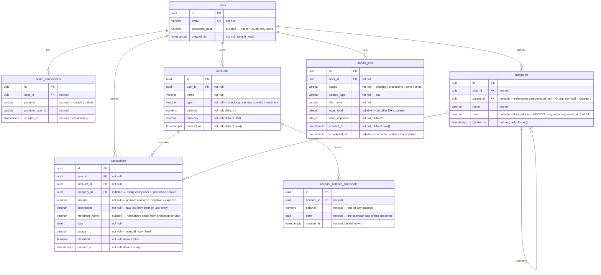

# Data Model

## Entity Relationship Diagram

## Table Descriptions

### `users`

Central identity table. A user may log in via email/password, OAuth, or both.

| Column | Type | Notes |
|--------|------|-------|
| `id` | `uuid` | Generated with `gen_random_uuid()` |
| `email` | `varchar(255)` | Unique, case-insensitive |
| `password_hash` | `varchar(255)` | bcrypt hash; null if user registered via OAuth only |
| `created_at` | `timestamptz` | Set on insert, never updated |

### `oauth_connections`

Stores one row per OAuth provider a user has linked. A user may have both Google and GitHub connected simultaneously.

| Column | Type | Notes |
|--------|------|-------|
| `id` | `uuid` | |
| `user_id` | `uuid` | FK → `users.id`, ON DELETE CASCADE |
| `provider` | `varchar(50)` | `google` or `github` |
| `provider_user_id` | `varchar(255)` | The ID the provider returns for this user |
| `created_at` | `timestamptz` | |

Unique constraint on `(provider, provider_user_id)` — a provider account can only be linked to one user.

### `accounts`

A financial account belonging to a user. Balance is maintained by summing transactions; it is **not** recomputed live — the `balance` column is updated on each transaction insert/update/delete.

| Column | Type | Notes |
|--------|------|-------|
| `id` | `uuid` | |
| `user_id` | `uuid` | FK → `users.id`, ON DELETE CASCADE |
| `name` | `varchar(100)` | e.g. "Chase Checking", "Amex Gold" |
| `type` | `varchar(50)` | `checking`, `savings`, `credit`, `investment` |
| `balance` | `numeric(15,2)` | Running balance; updated with each transaction |
| `currency` | `varchar(3)` | ISO 4217 code, e.g. `USD` |
| `created_at` | `timestamptz` | |

### `categories`

User-defined two-level hierarchy. Rows with `parent_id IS NULL` are **Groups** (broad labels like Food, Entertainment); rows with `parent_id` set are **Categories** (specific items like Groceries, Movies). There are no system-wide predefined entries — each user builds their own.

| Column | Type | Notes |
|--------|------|-------|
| `id` | `uuid` | |
| `user_id` | `uuid` | FK → `users.id`, ON DELETE CASCADE |
| `parent_id` | `uuid` | FK → `categories.id`, ON DELETE SET NULL; null = Group, non-null = Category |
| `name` | `varchar(100)` | e.g. "Entertainment", "Movies" |
| `color` | `varchar(7)` | Hex color, e.g. `#EC407A`; only set for Groups (`parent_id IS NULL`); Categories inherit their Group's color |
| `created_at` | `timestamptz` | |

Unique constraint on `(user_id, parent_id, name)` — no duplicate names within the same group or at the top level.

A transaction's `category_id` may point to either a Group or a Category. Deleting a Group orphans its child Categories (their `parent_id` is set to null, making them Groups). Deleting a Category nullifies `category_id` on affected transactions.

### `transactions`

The core table. Every financial event is a transaction row.

| Column | Type | Notes |
|--------|------|-------|
| `id` | `uuid` | |
| `user_id` | `uuid` | FK → `users.id`, ON DELETE CASCADE |
| `account_id` | `uuid` | FK → `accounts.id`, ON DELETE RESTRICT |
| `category_id` | `uuid` | FK → `categories.id`, ON DELETE SET NULL; nullable |
| `amount` | `numeric(15,2)` | Signed: positive = income, negative = expense |
| `description` | `varchar(500)` | Raw text — e.g. "AMZN MKTP US*RT19B1234" |
| `merchant_name` | `varchar(255)` | Normalized name from prediction service; nullable |
| `date` | `date` | Transaction date (not timestamp — bank data gives dates only) |
| `source` | `varchar(20)` | `manual`, `csv`, or `bank` |
| `classified` | `boolean` | `false` until prediction service has processed this row |
| `created_at` | `timestamptz` | |

### `account_balance_snapshots`

Stores one snapshot per account per day. Written atomically whenever a transaction modifies an account balance. Provides auditable balance history without recomputing from all transactions.

| Column | Type | Notes |
|--------|------|-------|
| `id` | `uuid` | |
| `account_id` | `uuid` | FK → `accounts.id`, ON DELETE CASCADE |
| `balance` | `numeric(15,2)` | End-of-day balance after the triggering transaction |
| `date` | `date` | The calendar date this snapshot represents |
| `created_at` | `timestamptz` | Set on insert, never updated |

Unique constraint on `(account_id, date)` — at most one snapshot per account per day. Inserting a transaction on a date that already has a snapshot updates the existing row.

---

### `import_jobs`

Tracks the status of CSV file uploads. Created when a file is received; updated as rows are processed.

| Column | Type | Notes |
|--------|------|-------|
| `id` | `uuid` | |
| `user_id` | `uuid` | FK → `users.id`, ON DELETE CASCADE |
| `status` | `varchar(20)` | `pending` → `processing` → `done` or `failed` |
| `source_type` | `varchar(20)` | `csv` (extensible for future bank integrations) |
| `file_name` | `varchar(255)` | Original filename from the upload |
| `rows_total` | `integer` | Set after the file is parsed; null until then |
| `rows_imported` | `integer` | Incremented as transactions are inserted |
| `created_at` | `timestamptz` | |
| `completed_at` | `timestamptz` | Set when status transitions to `done` or `failed` |

## Key Design Decisions

**UUIDs as primary keys** — safer than sequential integers for a multi-user API. Avoids leaking record counts and allows client-side ID generation if needed.

**Signed `amount` instead of `type` enum** — a single numeric column encodes direction. Simplifies aggregation queries (`SUM(amount)` gives net balance with no `CASE` statements).

**`category_id` is nullable** — transactions enter the system uncategorized (`classified = false`). The prediction service assigns `merchant_name` and `category_id` asynchronously. Users can also assign categories manually at any time.

**`account.balance` is denormalized** — recomputing balance from all transactions on every read would be expensive. Instead, balance is updated atomically whenever a transaction is inserted, updated, or deleted.

**`account_balance_snapshots` provides historical balance data** — the denormalized `balance` column only stores the current value. `account_balance_snapshots` keeps one row per account per day so the frontend can display a balance at any past date and render time-series charts without summing all historical transactions.
