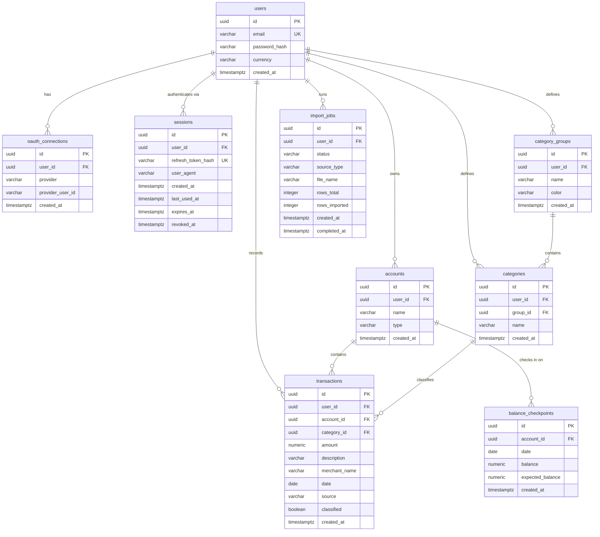

# Data Model

## Entity Relationship Diagram

```mermaid
erDiagram
    users {
        uuid        id              PK
        varchar     email           UK
        varchar     password_hash
        varchar     currency
        timestamptz created_at
    }

    oauth_connections {
        uuid        id              PK
        uuid        user_id         FK
        varchar     provider
        varchar     provider_user_id
        timestamptz created_at
    }

    sessions {
        uuid        id                  PK
        uuid        user_id             FK
        varchar     refresh_token_hash  UK
        varchar     user_agent
        timestamptz created_at
        timestamptz last_used_at
        timestamptz expires_at
        timestamptz revoked_at
    }

    accounts {
        uuid        id              PK
        uuid        user_id         FK
        varchar     name
        varchar     type
        timestamptz created_at
    }

    category_groups {
        uuid        id              PK
        uuid        user_id         FK
        varchar     name
        varchar     color
        timestamptz created_at
    }

    categories {
        uuid        id              PK
        uuid        user_id         FK
        uuid        group_id        FK
        varchar     name
        timestamptz created_at
    }

    transactions {
        uuid        id              PK
        uuid        user_id         FK
        uuid        account_id      FK
        uuid        category_id     FK
        numeric     amount
        varchar     description
        varchar     merchant_name
        date        date
        varchar     source
        boolean     classified
        timestamptz created_at
    }

    balance_checkpoints {
        uuid        id              PK
        uuid        account_id      FK
        date        date
        numeric     balance
        numeric     expected_balance
        timestamptz created_at
    }

    import_jobs {
        uuid        id              PK
        uuid        user_id         FK
        varchar     status
        varchar     source_type
        varchar     file_name
        integer     rows_total
        integer     rows_imported
        timestamptz created_at
        timestamptz completed_at
    }

    users            ||--o{ sessions                   : "authenticates via"
    users            ||--o{ oauth_connections          : "has"
    users            ||--o{ accounts                   : "owns"
    users            ||--o{ category_groups             : "defines"
    users            ||--o{ categories                 : "defines"
    users            ||--o{ transactions               : "records"
    users            ||--o{ import_jobs                : "runs"
    category_groups  ||--o{ categories                 : "contains"
    accounts         ||--o{ transactions               : "contains"
    accounts         ||--o{ balance_checkpoints         : "checks in on"
    categories       ||--o{ transactions               : "classifies"
```

## Table Descriptions

### `users`

Central identity table. A user may log in via email/password, OAuth, or both.

| Column | Type | Notes |
|--------|------|-------|
| `id` | `uuid` | Generated with `gen_random_uuid()` |
| `email` | `varchar(255)` | `UNIQUE`; always stored lowercase (see below) |
| `password_hash` | `varchar(255)` | bcrypt hash; null if user registered via OAuth only |
| `currency` | `varchar(3)` | ISO 4217 code, e.g. `USD`; `NOT NULL DEFAULT 'USD'`. Set once at registration and never editable afterward — see Key Design Decisions |
| `created_at` | `timestamptz` | Set on insert, never updated |

Email is normalized to lowercase before every write or lookup — `POST /auth/register`, `POST /auth/login`, `PUT /users/me`, and the OAuth callback's email lookup (`flows.md` §3) all lowercase the email first. `jane@example.com` and `Jane@Example.com` are the same account because no differently-cased value is ever stored, not because of a case-insensitive comparison at read time. This means the plain `UNIQUE(email)` constraint is sufficient — no `citext` extension or functional index on `lower(email)` is needed. The tradeoff: a user who types `Jane@Example.com` will see `jane@example.com` everywhere it's displayed (e.g. `GET /users/me`).

### `oauth_connections`

Stores one row per OAuth provider a user has linked. A user may have both Google and GitHub connected simultaneously.

| Column | Type | Notes |
|--------|------|-------|
| `id` | `uuid` | |
| `user_id` | `uuid` | FK → `users.id`, ON DELETE CASCADE |
| `provider` | `varchar(50)` | `google` or `github` |
| `provider_user_id` | `varchar(255)` | The ID the provider returns for this user |
| `created_at` | `timestamptz` | |

Unique constraint on `(provider, provider_user_id)` — a provider account can only be linked to one user.

### `sessions`

Backs the refresh-token side of the auth token lifecycle (see `flows.md` §2a/§2b, `api.md` Authentication section). One row per logged-in device/browser. The short-lived JWT access token (`token` cookie) is never stored anywhere — it's checked in-memory by the auth middleware and simply expires. This table exists so that the long-lived refresh token, which is what actually keeps a user logged in across 15-minute access-token expirations, can be revoked.

| Column | Type | Notes |
|--------|------|-------|
| `id` | `uuid` | Also embedded as the `sid` claim in every access token minted from this session, so a request can be traced back to the session that produced it without a DB lookup |
| `user_id` | `uuid` | FK → `users.id`, ON DELETE CASCADE |
| `refresh_token_hash` | `varchar(64)` | SHA-256 hex digest of the refresh token. `UNIQUE`. The raw token is never stored — only ever held in the client's `refresh_token` cookie |
| `user_agent` | `varchar(255)` | From the request that created the session; nullable; shown in the "your devices" list (`GET /auth/sessions`) so a user can tell sessions apart |
| `created_at` | `timestamptz` | |
| `last_used_at` | `timestamptz` | Updated each time this session's refresh token is used at `POST /auth/refresh` |
| `expires_at` | `timestamptz` | `created_at` + 30 days |
| `revoked_at` | `timestamptz` | `null` while active. Set on logout, explicit revocation (`DELETE /auth/sessions/:id`), rotation (superseded by a newer session on refresh), or mass revocation (`POST /auth/logout/all`, or automatic revoke-all if a revoked token is replayed — see `flows.md` §2a) |

A session is valid to refresh only if `revoked_at IS NULL AND expires_at > now()`. Rows are not deleted on revocation or expiry — kept for the "your devices" list and audit purposes.

### `accounts`

A financial account belonging to a user. There is no stored `balance` column — current balance is computed at read time from the account's most recent `balance_checkpoints` row plus the sum of transactions since that checkpoint's date. Every account has at least one checkpoint from the moment it's created (see `balance_checkpoints` below).

| Column | Type | Notes |
|--------|------|-------|
| `id` | `uuid` | |
| `user_id` | `uuid` | FK → `users.id`, ON DELETE CASCADE |
| `name` | `varchar(100)` | e.g. "Chase Checking", "Amex Gold" |
| `type` | `varchar(50)` | `checking`, `savings`, `credit`, `investment` |
| `created_at` | `timestamptz` | |

No `currency` column — currency is a single, user-level setting (`users.currency`), not per-account. See Key Design Decisions.

### `category_groups`

A user-defined broad label for organizing categories (e.g. "Food", "Entertainment"). There are no system-wide predefined entries — each user builds their own.

| Column | Type | Notes |
|--------|------|-------|
| `id` | `uuid` | |
| `user_id` | `uuid` | FK → `users.id`, ON DELETE CASCADE |
| `name` | `varchar(100)` | e.g. "Entertainment" |
| `color` | `varchar(7)` | Hex color, e.g. `#EC407A`; `NOT NULL` — required for every group |
| `created_at` | `timestamptz` | |

Unique constraint on `(user_id, name)` — no duplicate group names for a user. This is a plain constraint with no NULL-comparison edge case to work around, since `category_groups` has no nullable column that used to distinguish "group" from "category."

Deleting a group is blocked (`ON DELETE RESTRICT` on `categories.group_id`) while it still has categories — the DB rejects the delete, and the API surfaces this as `409`. This is enforced at the database level, not just checked in the service layer, so a concurrent insert of a new category can't race past an application-level check.

### `categories`

A specific spending item under exactly one group (e.g. "Groceries", "Movies" under "Entertainment"). There is no further nesting — a category cannot itself be a parent.

| Column | Type | Notes |
|--------|------|-------|
| `id` | `uuid` | |
| `user_id` | `uuid` | FK → `users.id`, ON DELETE CASCADE |
| `group_id` | `uuid` | FK → `category_groups.id`, ON DELETE RESTRICT; required |
| `name` | `varchar(100)` | e.g. "Groceries", "Movies" |
| `created_at` | `timestamptz` | |

Unique constraint on `(user_id, group_id, name)` — no duplicate category names within the same group.

`group_id` references `category_groups`, not `categories` itself, so there is no self-reference to misuse — a category can never become another category's parent. The two-level hierarchy is structural, enforced by which table the foreign key targets, rather than a rule checked in application code or a database trigger.

A category can be moved to a different group via `PUT /groups/categories/:id` (`group_id` field). Since groups and categories are separate tables, there's no way for this to accidentally turn a category into a group or vice versa — the field can only ever reference a row in `category_groups`. Moving a category does not affect `category_id` on any transaction referencing it, since the category's `id` is unchanged; it is retroactive for reporting, though — a transaction spent while a category was under "Entertainment" will show up under "Leisure" in historical reports once that category has been moved there, since only its current `group_id` is tracked, not a history of past group membership.

### `transactions`

The core table. Every financial event is a transaction row.

| Column | Type | Notes |
|--------|------|-------|
| `id` | `uuid` | |
| `user_id` | `uuid` | FK → `users.id`, ON DELETE CASCADE |
| `account_id` | `uuid` | FK → `accounts.id`, ON DELETE RESTRICT |
| `category_id` | `uuid` | FK → `categories.id`, ON DELETE SET NULL; nullable — always a category, never a group (groups and categories are separate tables) |
| `amount` | `numeric(15,2)` | Signed: positive = income, negative = expense |
| `description` | `varchar(500)` | Raw text — e.g. "AMZN MKTP US*RT19B1234" |
| `merchant_name` | `varchar(255)` | Normalized name set by prediction service on classification; nullable; not writable by the frontend |
| `date` | `date` | Transaction date (not timestamp — bank data gives dates only) |
| `source` | `varchar(20)` | `manual`, `csv`, or `bank` — set by the backend, never by the frontend |
| `classified` | `boolean` | `false` until prediction service has processed this row |
| `dedup_hash` | `varchar(64)` | SHA-256 hex digest of `date + amount + description + account_id`, computed at CSV import time; `null` for `manual` and `bank` rows, which aren't subject to import-dedup |
| `is_duplicate` | `boolean` | `NOT NULL DEFAULT false`. Set `true` at insert time if a transaction with the same `dedup_hash` already existed for the account. Informational only — duplicates are still inserted, not rejected, so the user can review and delete them (or dismiss the flag) manually. See `flows.md` §5 |
| `created_at` | `timestamptz` | |

Index on `(account_id, dedup_hash)` (non-unique — deliberately so, since a flagged duplicate is a real, kept row, not a rejected insert) makes the per-batch dedup lookup during CSV import cheap. This is an application-level dedup check, not a DB constraint: nothing stops two rows with the same hash existing, by design.

### `balance_checkpoints`

A user-entered statement of an account's balance as of the end of a specific day. This is the account's only source of "current balance" — nothing is derived from summing every transaction since the account was created. Checkpoints are **append-only**: they are never edited or deleted. Correcting a mistake means adding a new checkpoint, not modifying the old one.

| Column | Type | Notes |
|--------|------|-------|
| `id` | `uuid` | |
| `account_id` | `uuid` | FK → `accounts.id`, ON DELETE CASCADE |
| `date` | `date` | The calendar date this checkpoint represents; balance as of the **end** of this day |
| `balance` | `numeric(15,2)` | User-stated balance |
| `expected_balance` | `numeric(15,2)` | System-computed balance immediately before this checkpoint was entered (previous checkpoint's balance + transactions since); `null` for an account's first checkpoint, which has nothing to compare against |
| `created_at` | `timestamptz` | Set on insert, never updated |

An account's **current balance** is always: `(latest checkpoint's balance) + SUM(amount)` of transactions with `date >` the latest checkpoint's date. "Latest" means the checkpoint with the greatest `(date, created_at)` — a new checkpoint's `date` must be on or after the account's current latest checkpoint's `date`, but same-day corrections are allowed (multiple checkpoints may share a `date`; the most recently created one wins).

Every account has at least one checkpoint from creation — `POST /accounts` creates the account row and its first checkpoint together.

Transactions dated on or before the latest checkpoint's `date` are in a **closed period**: they no longer affect current balance, and their `amount` and `date` cannot be edited (see `PUT /transactions/:id` in `api.md`). This is intentional — once a period is reconciled against a real statement balance, it stays reconciled.

---

### `import_jobs`

Tracks the status of CSV file uploads. Created when a file is received; updated as rows are processed.

| Column | Type | Notes |
|--------|------|-------|
| `id` | `uuid` | |
| `user_id` | `uuid` | FK → `users.id`, ON DELETE CASCADE |
| `status` | `varchar(20)` | `pending` → `processing` → `done` or `failed` |
| `source_type` | `varchar(20)` | `csv` (extensible for future bank integrations) |
| `file_name` | `varchar(255)` | Original filename from the upload |
| `rows_total` | `integer` | Set after the file is parsed; null until then |
| `rows_imported` | `integer` | Incremented as transactions are inserted — includes rows flagged `is_duplicate` (they're still inserted; see `transactions.is_duplicate` above) |
| `rows_duplicate` | `integer` | Count of imported rows flagged `is_duplicate = true`. A subset of `rows_imported`, not additional to it |
| `rows_failed` | `integer` | Count of rows that could not be parsed or inserted at all (e.g. unparseable date or amount) and were skipped entirely — not present in `transactions` |
| `row_errors` | `jsonb` | Array of `{ "row": <1-indexed row number in the file>, "reason": "<short code, e.g. invalid_date>" }`, one entry per row counted in `rows_failed`. `null`/empty when `rows_failed = 0` |
| `created_at` | `timestamptz` | |
| `completed_at` | `timestamptz` | Set when status transitions to `done` or `failed` |

Invariant: `rows_total = rows_imported + rows_failed` — every parsed row ends up either inserted (possibly flagged duplicate) or recorded as a failure in `row_errors`, so the gap between `rows_total` and `rows_imported` is always fully explained by `rows_failed`, never a silent drop.

A `processing` job can also be moved to `failed` by the startup recovery sweep (`flows.md` §5a) if the server restarted mid-import and abandoned it — not only by an in-flight failure during `ProcessCSV` itself.

## Key Design Decisions

**Access tokens are stateless and short-lived (15 min); only the refresh token is tracked server-side** — the `sessions` table stores a hash of each refresh token, not the access JWT. This keeps the auth middleware's per-request check fast (no DB round trip — see `flows.md` §4), at the cost of a bounded revocation lag: a stolen access token stays usable for up to 15 minutes even after the corresponding session is revoked. The refresh token itself (and therefore all future access tokens) is revocable immediately, via `sessions.revoked_at`.

**Email is normalized to lowercase at write time, not compared case-insensitively at read time** — avoids a `citext` column or a functional index on `lower(email)`; the plain `UNIQUE(email)` constraint enforces case-insensitive uniqueness because no differently-cased value is ever stored. Every code path that writes or looks up a user by email normalizes first (see the `users` table notes above).

**UUIDs as primary keys** — safer than sequential integers for a multi-user API. Avoids leaking record counts and allows client-side ID generation if needed.

**Signed `amount` instead of `type` enum** — a single numeric column encodes direction. Simplifies aggregation queries (`SUM(amount)` gives net balance with no `CASE` statements) — this holds because every account a user owns shares one currency (see below), so summing `amount` across accounts is always meaningful.

**Currency is a single, immutable, user-level setting, not per-account** — `users.currency` (`NOT NULL DEFAULT 'USD'`) applies to every account the user owns; `accounts` has no `currency` column at all, so there's no way for a user's accounts to end up denominated differently and no case where summing `amount` across accounts silently mixes currencies. It's set once at registration and has no update path (no `PUT /users/me` support) — since there's no FX conversion or rate history in this design, allowing it to change would leave every existing balance and transaction amount silently mislabeled as being in the new currency. Multi-currency support (per-account currencies, FX rates, a display-currency preference) is out of scope for v1; this would need a dedicated redesign, not a field added back onto `accounts`.

**`category_id` is nullable** — transactions enter the system uncategorized (`classified = false`). The prediction service assigns `merchant_name` and `category_id` asynchronously. Users can also assign categories manually at any time. It always references `categories`, never `category_groups` — a transaction can't be tagged at the group level, only at the specific-category level.

**Groups and categories are separate tables, not a self-referencing hierarchy** — `category_groups` and `categories` split what used to be one table with a nullable `parent_id`. This makes the two-level hierarchy structural instead of a rule enforced by application code or a database trigger: a category's `group_id` targets `category_groups`, so a 3-level chain isn't just disallowed, it's impossible to construct. It also lets `color` be a plain `NOT NULL` column on `category_groups` instead of a conditionally-relevant field shared across two different "kinds" of row, and reduces both uniqueness constraints to ordinary `UNIQUE`s with no NULL-comparison edge case to work around.

**Balance is anchored to user-entered checkpoints, not derived from full transaction history** — `accounts` has no stored `balance` column. Current balance is always `latest checkpoint + transactions since`, computed at read time. A transaction write only ever touches the `transactions` table — no cross-table balance bookkeeping on insert/update/delete, and no risk of a stored balance drifting from what the transactions actually say.

**Checkpoints double as reconciliation, not just history** — because `balance_checkpoints.expected_balance` records what the system would have calculated at that moment, the gap between it and the user-stated `balance` is a first-class, visible number (`discrepancy`, surfaced by `POST`/`GET /accounts/:id/checkpoints`) instead of a silent correction. Checkpoints are append-only and non-decreasing in date, which keeps "a reconciled period never retroactively changes" simple to reason about — there's no case where inserting or deleting a checkpoint reopens a period that was already closed.
