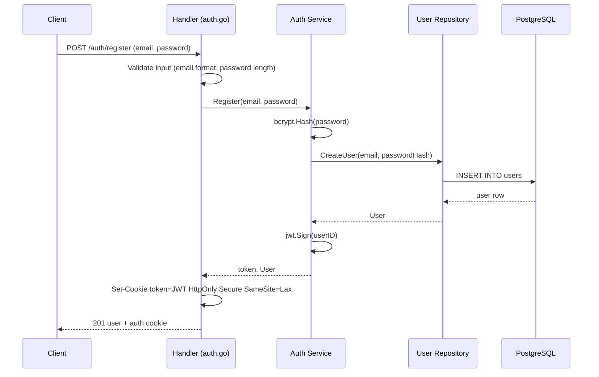
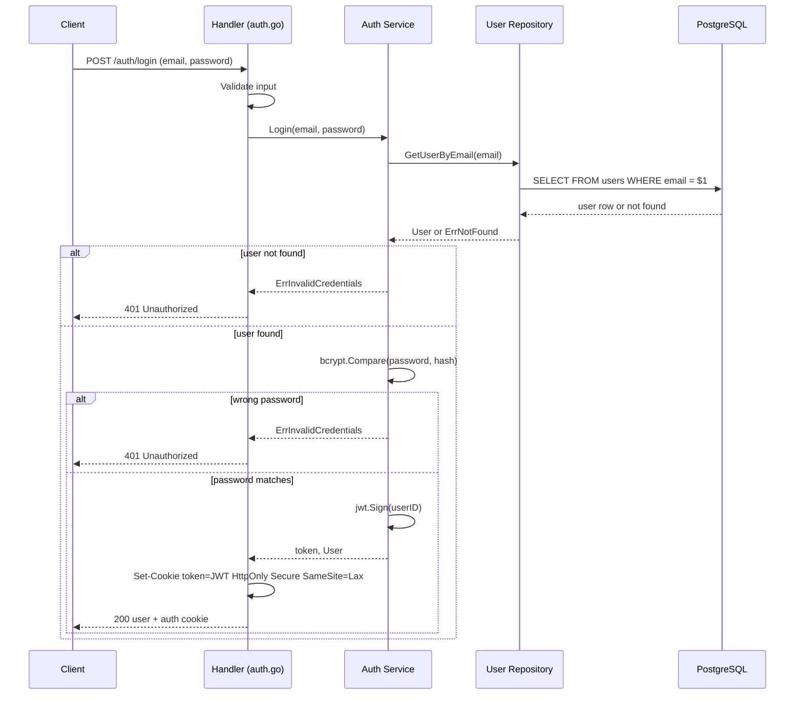
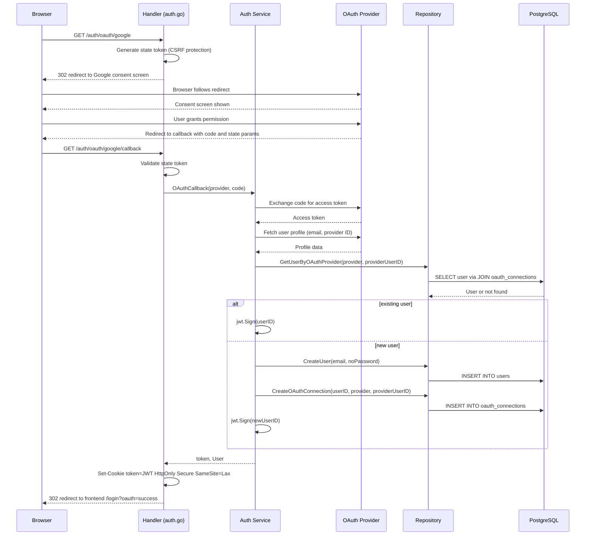
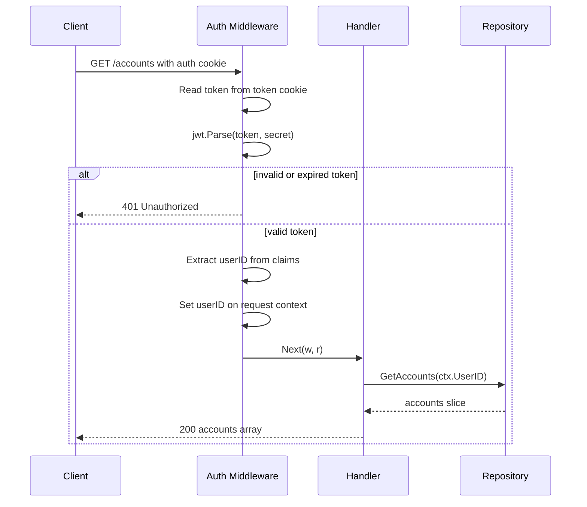
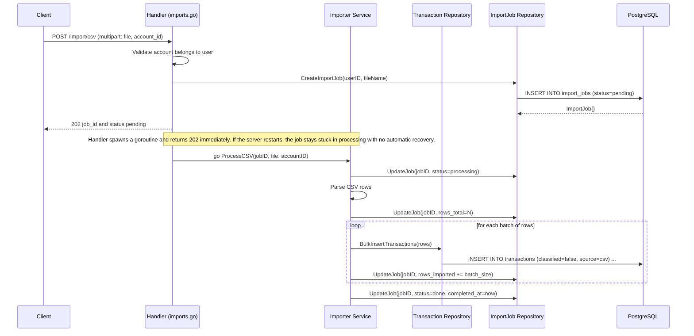
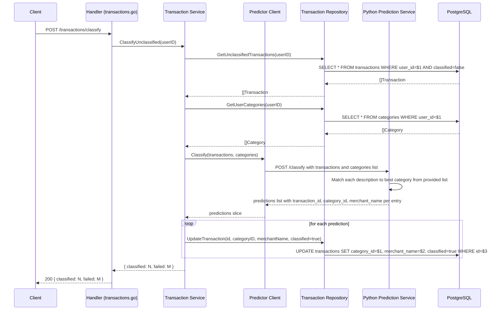
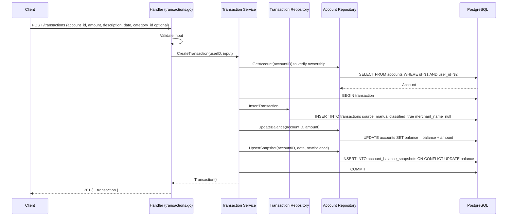

# Key Flows

Sequence diagrams for the most important request paths through the backend.

---

## 1. Email/Password Registration



---

## 2. Email/Password Login



---

## 3. OAuth Login (Google or GitHub)



---

## 4. Authenticated Request (JWT Middleware)

Every protected endpoint runs this flow before the handler is called.



---

## 5. CSV Import



---

## 6. Transaction Classification (Prediction Service)



---

## 7. Manual Transaction Creation



---

## 8. Account Balance Snapshot Maintenance

Every operation that changes a transaction's `amount` or `date` must keep `accounts.balance` and `account_balance_snapshots` consistent. All three writes happen inside a single database transaction.

### Invariants

- `accounts.balance` is always the running total of **all** transactions for that account.
- `account_balance_snapshots` holds at most one row per `(account_id, date)`. A row represents the account balance at the **end of that calendar day**, after all transactions on that date.
- Snapshots only exist for dates that have at least one transaction. Dates with no transactions have no snapshot row — callers interpolate from the nearest prior snapshot.

### Insert

```
accounts.balance  += amount
UPSERT account_balance_snapshots (account_id, date, balance=accounts.balance)
```

### Delete

```
accounts.balance  -= amount
remaining = SUM(amount) of transactions on account for this date (excluding deleted row)
IF remaining != 0 OR snapshot already existed for an earlier reason:
    UPSERT account_balance_snapshots (account_id, date, balance=accounts.balance)
ELSE:
    DELETE FROM account_balance_snapshots WHERE account_id=? AND date=?
```

### Update — amount changed, date unchanged

```
delta = new_amount - old_amount
accounts.balance  += delta
UPSERT account_balance_snapshots (account_id, date, balance=accounts.balance)
```

### Update — date changed (amount may also change)

```
delta = new_amount - old_amount          -- 0 if only date changed
accounts.balance  += delta               -- net effect on running balance

-- Recalculate old-date snapshot
old_daily_sum = SUM(amount) of remaining transactions on account for old_date
IF old_daily_sum != 0:
    UPSERT account_balance_snapshots (account_id, old_date, balance = <prior_day_balance> + old_daily_sum)
ELSE:
    DELETE FROM account_balance_snapshots WHERE account_id=? AND date=old_date

-- Apply new-date snapshot
UPSERT account_balance_snapshots (account_id, new_date, balance = accounts.balance)
```

> **Note on prior_day_balance:** When recalculating the old-date snapshot, "prior day balance" is computed as `accounts.balance - SUM(all transactions on account with date >= old_date)`. This keeps the old-date snapshot accurate without recomputing every subsequent snapshot.
