# Key Flows

Sequence diagrams for the most important request paths through the backend.

`POST /auth/register`, `POST /auth/login`, and `POST /auth/refresh` (§1, §2, §2a below) sit behind rate-limiting middleware — per-IP and, for register/login, per-email — before any of the steps shown in their diagrams run. It's omitted from the diagrams themselves to keep them focused on the auth logic; see `architecture.md` Rate Limiting for the limits and keying.

---

## 1. Email/Password Registration

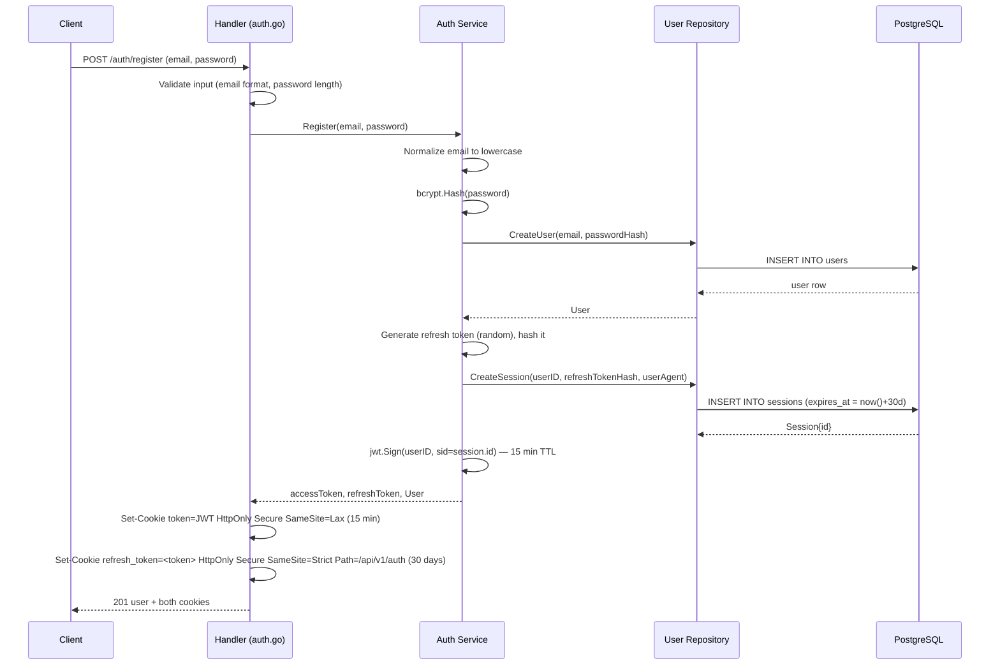
```mermaid
sequenceDiagram
    participant C as Client
    participant H as Handler (auth.go)
    participant S as Auth Service
    participant R as User Repository
    participant DB as PostgreSQL

    C->>H: POST /auth/register (email, password)
    H->>H: Validate input (email format, password length)
    H->>S: Register(email, password)
    S->>S: Normalize email to lowercase
    S->>S: bcrypt.Hash(password)
    S->>R: CreateUser(email, passwordHash)
    R->>DB: INSERT INTO users
    DB-->>R: user row
    R-->>S: User
    S->>S: Generate refresh token (random), hash it
    S->>R: CreateSession(userID, refreshTokenHash, userAgent)
    R->>DB: INSERT INTO sessions (expires_at = now()+30d)
    DB-->>R: Session{id}
    S->>S: jwt.Sign(userID, sid=session.id) — 15 min TTL
    S-->>H: accessToken, refreshToken, User
    H->>H: Set-Cookie token=JWT HttpOnly Secure SameSite=Lax (15 min)
    H->>H: Set-Cookie refresh_token=<token> HttpOnly Secure SameSite=Strict Path=/api/v1/auth (30 days)
    H-->>C: 201 user + both cookies
```

---

## 2. Email/Password Login

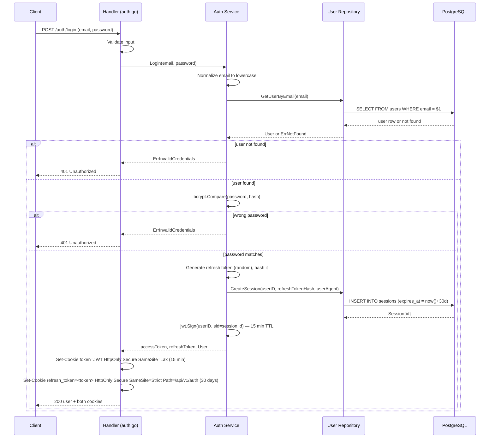
```mermaid
sequenceDiagram
    participant C as Client
    participant H as Handler (auth.go)
    participant S as Auth Service
    participant R as User Repository
    participant DB as PostgreSQL

    C->>H: POST /auth/login (email, password)
    H->>H: Validate input
    H->>S: Login(email, password)
    S->>S: Normalize email to lowercase
    S->>R: GetUserByEmail(email)
    R->>DB: SELECT FROM users WHERE email = $1
    DB-->>R: user row or not found
    R-->>S: User or ErrNotFound
    alt user not found
        S-->>H: ErrInvalidCredentials
        H-->>C: 401 Unauthorized
    else user found
        S->>S: bcrypt.Compare(password, hash)
        alt wrong password
            S-->>H: ErrInvalidCredentials
            H-->>C: 401 Unauthorized
        else password matches
            S->>S: Generate refresh token (random), hash it
            S->>R: CreateSession(userID, refreshTokenHash, userAgent)
            R->>DB: INSERT INTO sessions (expires_at = now()+30d)
            DB-->>R: Session{id}
            S->>S: jwt.Sign(userID, sid=session.id) — 15 min TTL
            S-->>H: accessToken, refreshToken, User
            H->>H: Set-Cookie token=JWT HttpOnly Secure SameSite=Lax (15 min)
            H->>H: Set-Cookie refresh_token=<token> HttpOnly Secure SameSite=Strict Path=/api/v1/auth (30 days)
            H-->>C: 200 user + both cookies
        end
    end
```

---

## 2a. Token Refresh

The access token (`token` cookie) expires every 15 minutes by design — the frontend calls this endpoint (proactively, or reactively after a `401`) to get a new one without forcing the user to log in again, as long as the refresh token is still valid.

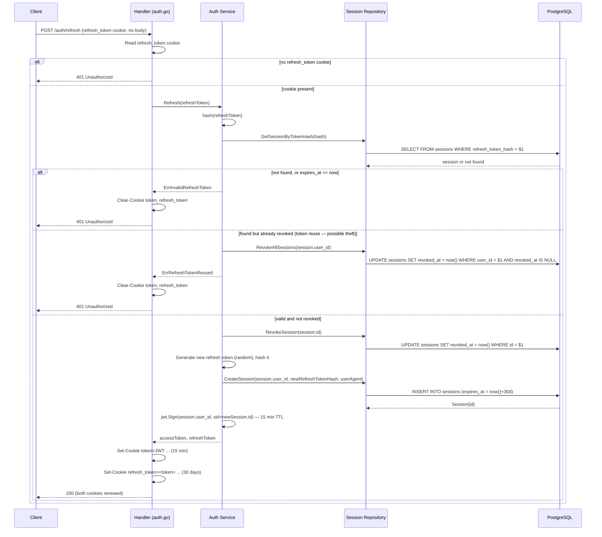
```mermaid
sequenceDiagram
    participant C as Client
    participant H as Handler (auth.go)
    participant S as Auth Service
    participant R as Session Repository
    participant DB as PostgreSQL

    C->>H: POST /auth/refresh (refresh_token cookie, no body)
    H->>H: Read refresh_token cookie
    alt no refresh_token cookie
        H-->>C: 401 Unauthorized
    else cookie present
        H->>S: Refresh(refreshToken)
        S->>S: hash(refreshToken)
        S->>R: GetSessionByTokenHash(hash)
        R->>DB: SELECT FROM sessions WHERE refresh_token_hash = $1
        DB-->>R: session or not found

        alt not found, or expires_at <= now
            S-->>H: ErrInvalidRefreshToken
            H->>H: Clear-Cookie token, refresh_token
            H-->>C: 401 Unauthorized
        else found but already revoked (token reuse — possible theft)
            S->>R: RevokeAllSessions(session.user_id)
            R->>DB: UPDATE sessions SET revoked_at = now() WHERE user_id = $1 AND revoked_at IS NULL
            S-->>H: ErrRefreshTokenReused
            H->>H: Clear-Cookie token, refresh_token
            H-->>C: 401 Unauthorized
        else valid and not revoked
            S->>R: RevokeSession(session.id)
            R->>DB: UPDATE sessions SET revoked_at = now() WHERE id = $1
            S->>S: Generate new refresh token (random), hash it
            S->>R: CreateSession(session.user_id, newRefreshTokenHash, userAgent)
            R->>DB: INSERT INTO sessions (expires_at = now()+30d)
            DB-->>R: Session{id}
            S->>S: jwt.Sign(session.user_id, sid=newSession.id) — 15 min TTL
            S-->>H: accessToken, refreshToken
            H->>H: Set-Cookie token=JWT ... (15 min)
            H->>H: Set-Cookie refresh_token=<token> ... (30 days)
            H-->>C: 200 (both cookies renewed)
        end
    end
```

Rotation means every refresh token is single-use: each call to this endpoint revokes the session it was presented with and creates a fresh one. If a refresh token is ever presented *after* it's already been rotated away, that's a strong signal it was stolen and used by someone else before (or after) its legitimate owner — the response is to revoke every session for that user, forcing a full re-login everywhere.

---

## 2b. Logout

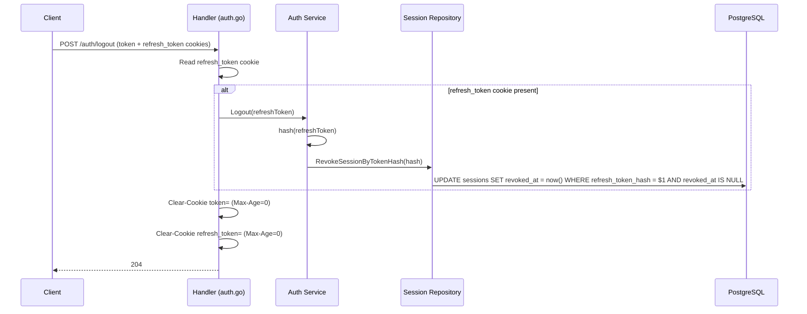
```mermaid
sequenceDiagram
    participant C as Client
    participant H as Handler (auth.go)
    participant S as Auth Service
    participant R as Session Repository
    participant DB as PostgreSQL

    C->>H: POST /auth/logout (token + refresh_token cookies)
    H->>H: Read refresh_token cookie
    alt refresh_token cookie present
        H->>S: Logout(refreshToken)
        S->>S: hash(refreshToken)
        S->>R: RevokeSessionByTokenHash(hash)
        R->>DB: UPDATE sessions SET revoked_at = now() WHERE refresh_token_hash = $1 AND revoked_at IS NULL
    end
    H->>H: Clear-Cookie token= (Max-Age=0)
    H->>H: Clear-Cookie refresh_token= (Max-Age=0)
    H-->>C: 204
```

`POST /auth/logout/all` (auth required, access token only) follows the same shape but revokes every non-revoked session belonging to `ctx.UserID` instead of looking one up by refresh token — this is the "log out everywhere" action, e.g. after a stolen-device scare. It also clears the caller's own cookies, since that session is included in the revocation.

---

## 2c. Password Set / Change

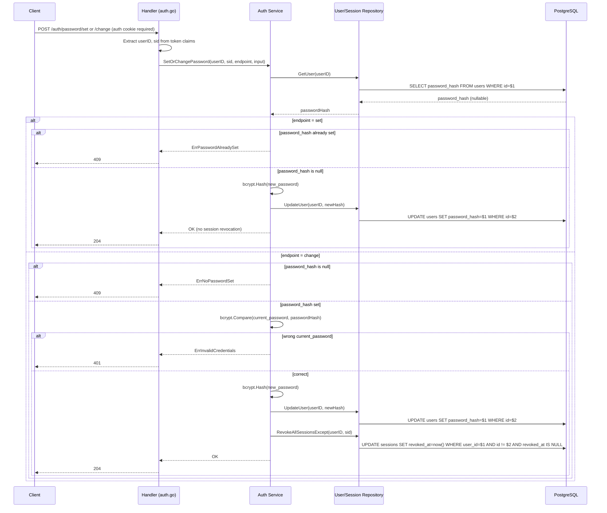
```mermaid
sequenceDiagram
    participant C as Client
    participant H as Handler (auth.go)
    participant S as Auth Service
    participant R as User/Session Repository
    participant DB as PostgreSQL

    C->>H: POST /auth/password/set or /change (auth cookie required)
    H->>H: Extract userID, sid from token claims
    H->>S: SetOrChangePassword(userID, sid, endpoint, input)
    S->>R: GetUser(userID)
    R->>DB: SELECT password_hash FROM users WHERE id=$1
    DB-->>R: password_hash (nullable)
    R-->>S: passwordHash

    alt endpoint = set
        alt password_hash already set
            S-->>H: ErrPasswordAlreadySet
            H-->>C: 409
        else password_hash is null
            S->>S: bcrypt.Hash(new_password)
            S->>R: UpdateUser(userID, newHash)
            R->>DB: UPDATE users SET password_hash=$1 WHERE id=$2
            S-->>H: OK (no session revocation)
            H-->>C: 204
        end
    else endpoint = change
        alt password_hash is null
            S-->>H: ErrNoPasswordSet
            H-->>C: 409
        else password_hash set
            S->>S: bcrypt.Compare(current_password, passwordHash)
            alt wrong current_password
                S-->>H: ErrInvalidCredentials
                H-->>C: 401
            else correct
                S->>S: bcrypt.Hash(new_password)
                S->>R: UpdateUser(userID, newHash)
                R->>DB: UPDATE users SET password_hash=$1 WHERE id=$2
                S->>R: RevokeAllSessionsExcept(userID, sid)
                R->>DB: UPDATE sessions SET revoked_at=now() WHERE user_id=$1 AND id != $2 AND revoked_at IS NULL
                S-->>H: OK
                H-->>C: 204
            end
        end
    end
```

`set` never touches `sessions` — nothing about the account's trust state has changed, since setting a first password doesn't invalidate anything that was already trusted. `change` revokes every *other* session (`id != sid`), the same targeted shape as `DELETE /auth/sessions/:id` but applied in bulk — the caller just proved their current password, so their own session is left alone, while every other device is signed out on the assumption that a password change is often a reaction to suspected compromise.

---

## 2d. Password Reset Request

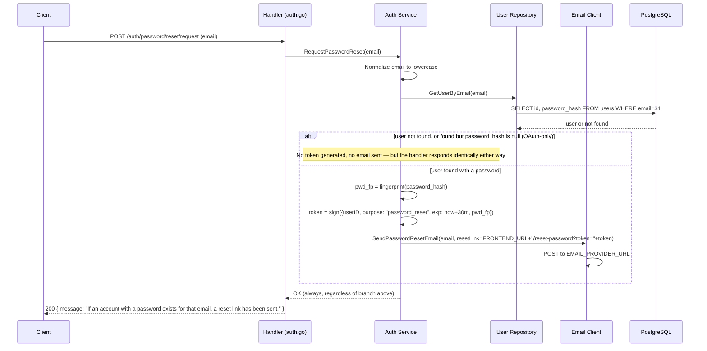
```mermaid
sequenceDiagram
    participant C as Client
    participant H as Handler (auth.go)
    participant S as Auth Service
    participant R as User Repository
    participant E as Email Client
    participant DB as PostgreSQL

    C->>H: POST /auth/password/reset/request (email)
    H->>S: RequestPasswordReset(email)
    S->>S: Normalize email to lowercase
    S->>R: GetUserByEmail(email)
    R->>DB: SELECT id, password_hash FROM users WHERE email=$1
    DB-->>R: user or not found

    alt user not found, or found but password_hash is null (OAuth-only)
        Note over S: No token generated, no email sent — but the handler responds identically either way
    else user found with a password
        S->>S: pwd_fp = fingerprint(password_hash)
        S->>S: token = sign({userID, purpose: "password_reset", exp: now+30m, pwd_fp})
        S->>E: SendPasswordResetEmail(email, resetLink=FRONTEND_URL+"/reset-password?token="+token)
        E->>E: POST to EMAIL_PROVIDER_URL
    end

    S-->>H: OK (always, regardless of branch above)
    H-->>C: 200 { message: "If an account with a password exists for that email, a reset link has been sent." }
```

The two branches converge on the exact same response — same status code, same body, same timing budget the service aims for — specifically so the endpoint can't be used to test whether an email is registered. See `data-model.md` Key Design Decisions ("Password-reset tokens are stateless and self-invalidating") for the `pwd_fp` mechanism.

---

## 2e. Password Reset Confirm

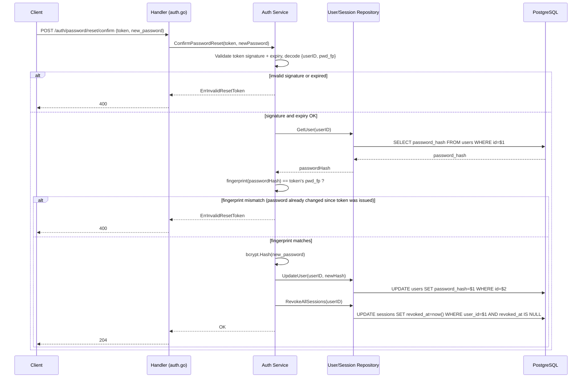
```mermaid
sequenceDiagram
    participant C as Client
    participant H as Handler (auth.go)
    participant S as Auth Service
    participant R as User/Session Repository
    participant DB as PostgreSQL

    C->>H: POST /auth/password/reset/confirm (token, new_password)
    H->>S: ConfirmPasswordReset(token, newPassword)
    S->>S: Validate token signature + expiry, decode {userID, pwd_fp}
    alt invalid signature or expired
        S-->>H: ErrInvalidResetToken
        H-->>C: 400
    else signature and expiry OK
        S->>R: GetUser(userID)
        R->>DB: SELECT password_hash FROM users WHERE id=$1
        DB-->>R: password_hash
        R-->>S: passwordHash
        S->>S: fingerprint(passwordHash) == token's pwd_fp ?
        alt fingerprint mismatch (password already changed since token was issued)
            S-->>H: ErrInvalidResetToken
            H-->>C: 400
        else fingerprint matches
            S->>S: bcrypt.Hash(new_password)
            S->>R: UpdateUser(userID, newHash)
            R->>DB: UPDATE users SET password_hash=$1 WHERE id=$2
            S->>R: RevokeAllSessions(userID)
            R->>DB: UPDATE sessions SET revoked_at=now() WHERE user_id=$1 AND revoked_at IS NULL
            S-->>H: OK
            H-->>C: 204
        end
    end
```

Every branch that rejects the token returns the same `400` with the same generic message (`api.md`) — an attacker probing a guessed or intercepted token can't distinguish "expired," "wrong signature," and "already used" (which surfaces as a fingerprint mismatch, since a successful prior reset changed `password_hash`). Unlike `change` (§2c), this revokes *every* session including whichever one might still be active — there's no authenticated caller session to preserve, and a reset is a recovery action that should assume the account may have been compromised. This endpoint deliberately doesn't set cookies or log the user in — the user logs in fresh afterward, the same posture as refresh-token-reuse detection (§2a) forcing a full re-login rather than trying to be clever about which session to trust.

---

## 3. OAuth Login (Google or GitHub)

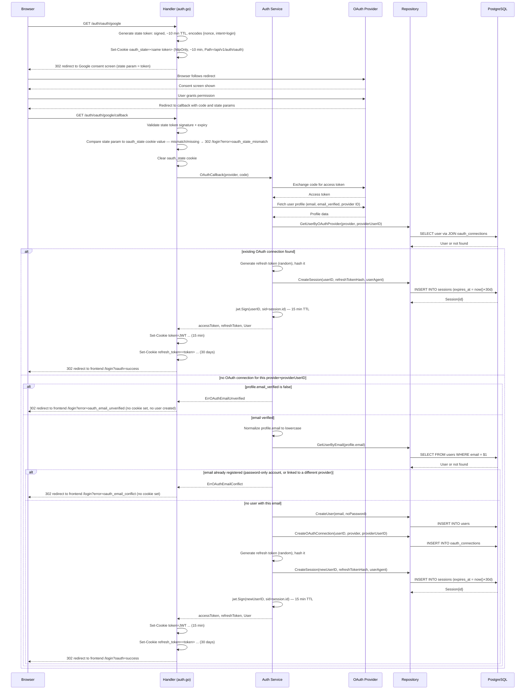
```mermaid
sequenceDiagram
    participant C as Browser
    participant H as Handler (auth.go)
    participant S as Auth Service
    participant O as OAuth Provider
    participant R as Repository
    participant DB as PostgreSQL

    C->>H: GET /auth/oauth/google
    H->>H: Generate state token: signed, ~10 min TTL, encodes {nonce, intent=login}
    H->>H: Set-Cookie oauth_state=<same token> (httpOnly, ~10 min, Path=/api/v1/auth/oauth)
    H-->>C: 302 redirect to Google consent screen (state param = token)

    C->>O: Browser follows redirect
    O-->>C: Consent screen shown
    C->>O: User grants permission
    O-->>C: Redirect to callback with code and state params

    C->>H: GET /auth/oauth/google/callback
    H->>H: Validate state token signature + expiry
    H->>H: Compare state param to oauth_state cookie value — mismatch/missing → 302 /login?error=oauth_state_mismatch
    H->>H: Clear oauth_state cookie
    H->>S: OAuthCallback(provider, code)
    S->>O: Exchange code for access token
    O-->>S: Access token
    S->>O: Fetch user profile (email, email_verified, provider ID)
    O-->>S: Profile data

    S->>R: GetUserByOAuthProvider(provider, providerUserID)
    R->>DB: SELECT user via JOIN oauth_connections
    DB-->>R: User or not found

    alt existing OAuth connection found
        S->>S: Generate refresh token (random), hash it
        S->>R: CreateSession(userID, refreshTokenHash, userAgent)
        R->>DB: INSERT INTO sessions (expires_at = now()+30d)
        DB-->>R: Session{id}
        S->>S: jwt.Sign(userID, sid=session.id) — 15 min TTL
        S-->>H: accessToken, refreshToken, User
        H->>H: Set-Cookie token=JWT ... (15 min)
        H->>H: Set-Cookie refresh_token=<token> ... (30 days)
        H-->>C: 302 redirect to frontend /login?oauth=success
    else no OAuth connection for this provider+providerUserID
        alt profile.email_verified is false
            S-->>H: ErrOAuthEmailUnverified
            H-->>C: 302 redirect to frontend /login?error=oauth_email_unverified (no cookie set, no user created)
        else email verified
            S->>S: Normalize profile.email to lowercase
            S->>R: GetUserByEmail(profile.email)
            R->>DB: SELECT FROM users WHERE email = $1
            DB-->>R: User or not found
            alt email already registered (password-only account, or linked to a different provider)
                S-->>H: ErrOAuthEmailConflict
                H-->>C: 302 redirect to frontend /login?error=oauth_email_conflict (no cookie set)
            else no user with this email
                S->>R: CreateUser(email, noPassword)
                R->>DB: INSERT INTO users
                S->>R: CreateOAuthConnection(userID, provider, providerUserID)
                R->>DB: INSERT INTO oauth_connections
                S->>S: Generate refresh token (random), hash it
                S->>R: CreateSession(newUserID, refreshTokenHash, userAgent)
                R->>DB: INSERT INTO sessions (expires_at = now()+30d)
                DB-->>R: Session{id}
                S->>S: jwt.Sign(newUserID, sid=session.id) — 15 min TTL
                S-->>H: accessToken, refreshToken, User
                H->>H: Set-Cookie token=JWT ... (15 min)
                H->>H: Set-Cookie refresh_token=<token> ... (30 days)
                H-->>C: 302 redirect to frontend /login?oauth=success
            end
        end
    end
```

`ErrOAuthEmailConflict` never creates or links anything — the user must log in with their existing method (password, or the OAuth provider already linked) and, if they want Google/GitHub login too, link it explicitly from settings (see §3a below). This is the deliberate alternative to auto-merging accounts by email, which would let anyone with a victim's email take over their account by registering a password first (see `open-issues.md` §1.1).

**`email_verified` gates the email-matching branch entirely.** `profile.email` is only trustworthy as an identity signal if the provider itself vouches for it — otherwise anyone can set their GitHub profile email to a victim's address and either get matched into the victim's existing account (if the conflict check ran) or squat a brand-new account under it. `email_verified` is checked *before* `GetUserByEmail` runs at all, so an unverified email never reaches the matching or account-creation logic; the flow fails closed with `ErrOAuthEmailUnverified`, not a same-outcome-either-way fallback. This check only applies to the "no existing OAuth connection" branch — a returning user matched by `(provider, provider_user_id)` (the `alt existing OAuth connection found` branch above) is already provably the same person as last time regardless of the current verification flag, so nothing about their session depends on it. Google's userinfo endpoint effectively always reports `email_verified: true` for the address it returns, so in practice this check only ever bites on GitHub, where a profile email can be unverified.

**`state` storage:** `state` is a signed, self-contained token (HMAC, ~10 min expiry) rather than a value kept in an in-memory map or shared server-side store — it works the same way regardless of how many backend processes are running. Validating the signature and expiry proves the token is genuine and unexpired, but not that the callback is happening in the same browser that started the flow: the `state` value travels through the provider's redirect and is visible in browser history and `Referer` headers, so an attacker who obtains it could replay it from their own browser. The `oauth_state` cookie is what closes that gap — it's set right before redirecting out and compared byte-for-byte against the `state` query param on callback, so a mismatch (or a missing cookie, e.g. the callback arriving in a different browser) is rejected as `oauth_state_mismatch`. This same mechanism covers §3a below.

---

## 3a. Linking an OAuth Provider to an Existing Account (Settings)

Reached from a settings page, by an already-authenticated user who wants to add Google/GitHub sign-in to an account they created with a password (or add a second provider). This is the only supported way to associate an OAuth identity with an account that already exists — never automatic, never triggered by a login attempt.

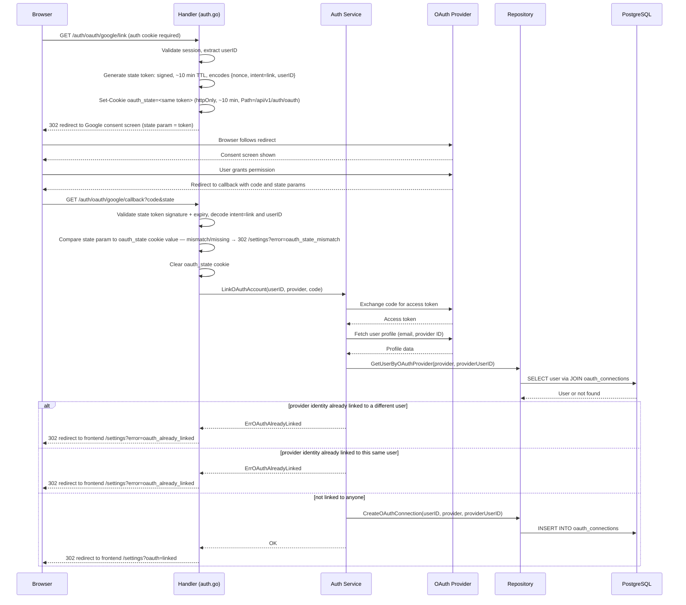
```mermaid
sequenceDiagram
    participant C as Browser
    participant H as Handler (auth.go)
    participant S as Auth Service
    participant O as OAuth Provider
    participant R as Repository
    participant DB as PostgreSQL

    C->>H: GET /auth/oauth/google/link (auth cookie required)
    H->>H: Validate session, extract userID
    H->>H: Generate state token: signed, ~10 min TTL, encodes {nonce, intent=link, userID}
    H->>H: Set-Cookie oauth_state=<same token> (httpOnly, ~10 min, Path=/api/v1/auth/oauth)
    H-->>C: 302 redirect to Google consent screen (state param = token)

    C->>O: Browser follows redirect
    O-->>C: Consent screen shown
    C->>O: User grants permission
    O-->>C: Redirect to callback with code and state params

    C->>H: GET /auth/oauth/google/callback?code&state
    H->>H: Validate state token signature + expiry, decode intent=link and userID
    H->>H: Compare state param to oauth_state cookie value — mismatch/missing → 302 /settings?error=oauth_state_mismatch
    H->>H: Clear oauth_state cookie
    H->>S: LinkOAuthAccount(userID, provider, code)
    S->>O: Exchange code for access token
    O-->>S: Access token
    S->>O: Fetch user profile (email, provider ID)
    O-->>S: Profile data

    S->>R: GetUserByOAuthProvider(provider, providerUserID)
    R->>DB: SELECT user via JOIN oauth_connections
    DB-->>R: User or not found

    alt provider identity already linked to a different user
        S-->>H: ErrOAuthAlreadyLinked
        H-->>C: 302 redirect to frontend /settings?error=oauth_already_linked
    else provider identity already linked to this same user
        S-->>H: ErrOAuthAlreadyLinked
        H-->>C: 302 redirect to frontend /settings?error=oauth_already_linked
    else not linked to anyone
        S->>R: CreateOAuthConnection(userID, provider, providerUserID)
        R->>DB: INSERT INTO oauth_connections
        S-->>H: OK
        H-->>C: 302 redirect to frontend /settings?oauth=linked
    end
```

The callback route (`GET /auth/oauth/:provider/callback`) is shared between §3 (login/signup) and §3a (linking) — the `state` token's `intent` field, set when the flow was initiated, determines which branch runs. `state` is otherwise handled as described in §3's CSRF notes.

The `UNIQUE (provider, provider_user_id)` constraint on `oauth_connections` (see `data-model.md`) is what actually guarantees a given Google/GitHub identity can only ever be linked to one user — the `GetUserByOAuthProvider` check above is the same lookup the login flow uses, kept consistent for both paths.

---

## 4. Authenticated Request (JWT Middleware)

Every protected endpoint runs this flow before the handler is called.

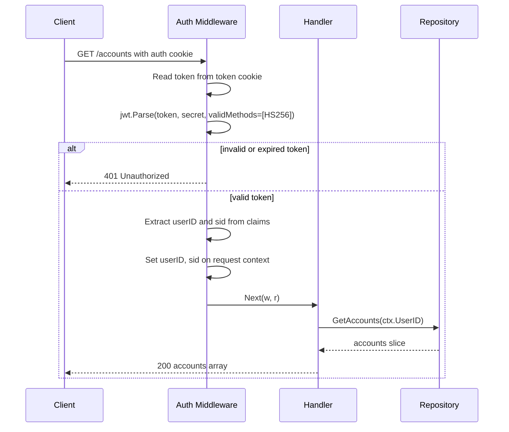
```mermaid
sequenceDiagram
    participant C as Client
    participant M as Auth Middleware
    participant H as Handler
    participant R as Repository

    C->>M: GET /accounts with auth cookie
    M->>M: Read token from token cookie
    M->>M: jwt.Parse(token, secret, validMethods=[HS256])
    alt invalid or expired token
        M-->>C: 401 Unauthorized
    else valid token
        M->>M: Extract userID and sid from claims
        M->>M: Set userID, sid on request context
        M->>H: Next(w, r)
        H->>R: GetAccounts(ctx.UserID)
        R-->>H: accounts slice
        H-->>C: 200 accounts array
    end
```

This middleware never queries `sessions` — it only checks the access token's signature and expiry, which is what keeps every authenticated request fast. This is also the source of the bounded revocation lag noted in `data-model.md`'s `sessions` design decision: revoking a session (logout, `DELETE /auth/sessions/:id`, or `POST /auth/logout/all`) stops future refreshes immediately, but an access token already issued from that session stays valid for up to its remaining 15-minute TTL. `sid` is carried on the context so `GET /auth/sessions` can mark which listed session is the one making the request ("this device").

`jwt.Parse` is called with an explicit `HS256`-only validator (`jwt.WithValidMethods`), not left to trust the token's own `alg` header — see `api.md` Authentication and `architecture.md` JWT Signing.

---

## 5. CSV Import

```mermaid
sequenceDiagram
    participant C as Client
    participant H as Handler (imports.go)
    participant IS as Importer Service
    participant TR as Transaction Repository
    participant IR as ImportJob Repository
    participant DB as PostgreSQL

    C->>H: POST /import/csv (multipart: file, account_id)
    H->>H: r.Body = http.MaxBytesReader(w, r.Body, CSV_IMPORT_MAX_FILE_SIZE_BYTES)
    alt file exceeds CSV_IMPORT_MAX_FILE_SIZE_BYTES
        H-->>C: 413 Payload Too Large (before any job row is created)
    else within size limit
        H->>H: Validate account belongs to user
        alt account not found or not owned by user
            H-->>C: 404
        else account ok
            H->>IR: CreateImportJob(userID, fileName)
            IR->>DB: INSERT INTO import_jobs (status=pending)
            alt user already has an active (pending/processing) import job
                DB-->>IR: unique violation (23505, partial unique index on (user_id) WHERE status IN ('pending','processing'))
                IR-->>H: ErrImportInProgress
                H-->>C: 409 Conflict
            else no active job for this user
                DB-->>IR: ImportJob{}
                H-->>C: 202 job_id and status pending

                Note over H,IS: Handler spawns a goroutine and returns 202 immediately. If the server restarts mid-processing, the in-flight goroutine is gone but the job row stays status=processing — see §5a for how it's recovered on the next startup.

                H->>IS: go ProcessCSV(jobID, file, accountID)
                IS->>IR: UpdateJob(jobID, status=processing)

                loop streamed one batch (up to 100 rows) at a time from csv.Reader, until EOF or CSV_IMPORT_MAX_ROWS exceeded
                    IS->>IS: Attempt to parse each row's date/amount — rows that fail are set aside (not inserted); rows_total tracked as a running count while streaming, not known up front
                    alt running rows_total exceeds CSV_IMPORT_MAX_ROWS mid-stream
                        IS->>IS: Stop reading further input; row_errors += { row: cutoff+1, reason: "row_limit_exceeded" }
                        IS->>IR: UpdateJob(jobID, status=failed, completed_at=now) — rows already committed by earlier batches are preserved as-is
                    else within the row cap
                        IS->>IS: For each parseable row in this batch: dedup_hash = sha256(date + amount + description + account_id)
                        IS->>TR: ExistingDedupHashes(accountID, batch's hashes)
                        TR->>DB: SELECT dedup_hash FROM transactions WHERE account_id=$1 AND dedup_hash = ANY($2)
                        DB-->>TR: set of hashes already present for this account
                        TR-->>IS: existing hash set
                        IS->>IS: mark is_duplicate=true on rows whose hash is in that set
                        IS->>TR: BulkInsertTransactions(rows, each with dedup_hash + is_duplicate)
                        TR->>DB: INSERT INTO transactions (classified=false, source=csv, dedup_hash, is_duplicate) ...
                        IS->>IR: UpdateJob(jobID, rows_total, rows_imported += inserted count, rows_duplicate += flagged count, rows_failed += unparseable count, row_errors += entries for unparseable rows)
                    end
                end

                IS->>IR: UpdateJob(jobID, status=done, completed_at=now) — only reached if streaming ran to EOF without hitting the row cap
            end
        end
    end
```

The dedup lookup is batched (one `SELECT ... = ANY($2)` per batch against that batch's hash set), not one query per row, so duplicate detection doesn't turn an already-batched insert loop back into row-at-a-time database round trips. A row that fails to parse never reaches the hash/dedup step at all — it's counted directly into `rows_failed` and `row_errors`, and a genuinely bad row can never be misreported as a duplicate or vice versa, since the two checks are mutually exclusive stages of the same loop.

**Parsing is streamed, not buffered.** `ProcessCSV` reads rows directly from `csv.Reader.Read()` in a loop and accumulates only the current batch (up to 100 rows) in memory before flushing it to the dedup-check-and-insert steps above — it never reads the full file into a slice first. This bounds per-import memory use to roughly one batch's worth of rows regardless of file size, and is what makes the row cap below enforceable mid-stream instead of only after a full parse.

**Three limits guard against resource exhaustion**, each closing a different gap:
- `CSV_IMPORT_MAX_FILE_SIZE_BYTES` (default 5 MiB) bounds the raw upload itself, checked via `http.MaxBytesReader` before any multipart parsing happens — the cheapest possible rejection point, and the only one of the three enforced synchronously in the handler rather than in the background goroutine.
- `CSV_IMPORT_MAX_ROWS` (default 50,000) bounds the amount of parsing and DB work one import can do, checked against the running row count as rows are streamed in. Exceeding it stops the import (`status=failed`, with a `row_limit_exceeded` entry in `row_errors`), but rows already committed in batches flushed before the cutoff are not rolled back — consistent with every other partial-failure case in this flow (see the dedup/parse-failure note above and `open-issues.md` §2.4).
- The partial unique index on `import_jobs(user_id) WHERE status IN ('pending','processing')` bounds concurrent work per user — at most one active import job at a time. `CreateImportJob`'s `INSERT` either succeeds or violates the index; the service catches the resulting unique-violation and the handler maps it to `409`, the same DB-enforced-not-app-checked pattern `transactions.category_id` uses for ownership (see `data-model.md`), so two near-simultaneous `POST /import/csv` calls can't both slip through a check-then-insert race the way a separate `SELECT` pre-check would allow.

None of these three limits are configurable per-user or per-request — they're global operator-tuned ceilings (env vars for the first two, a fixed DB constraint for the third), not part of the API contract.

The goroutine above is detached from the request lifecycle with no graceful-shutdown handling — a `SIGTERM` during a routine rolling deploy kills an in-flight `ProcessCSV` call exactly like a crash would, relying on the startup sweep (§5a) to notice it later. This is accepted, not fixed, for now — see `open-issues.md` §2.1.

---

## 5a. Startup Recovery Sweep (Stuck Import Jobs)

Runs once, synchronously, in `cmd/api/main.go` before the HTTP server starts accepting requests — a direct consequence of the note in §5: a server restart abandons any goroutine that was mid-`ProcessCSV`, leaving its `import_jobs` row stuck at `status=processing` forever with nothing left to move it forward.

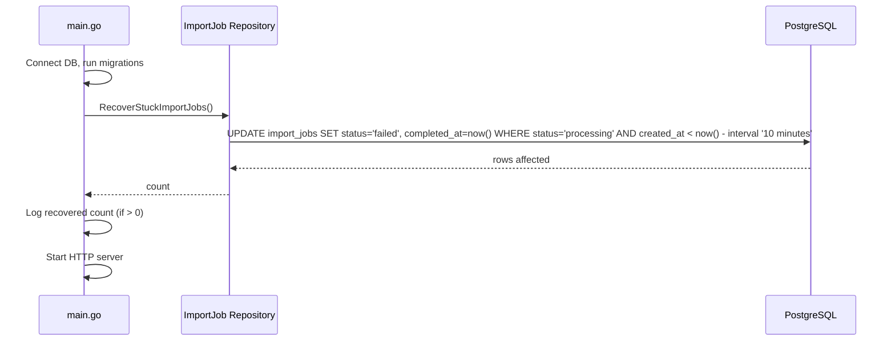
```mermaid
sequenceDiagram
    participant M as main.go
    participant IR as ImportJob Repository
    participant DB as PostgreSQL

    M->>M: Connect DB, run migrations
    M->>IR: RecoverStuckImportJobs()
    IR->>DB: UPDATE import_jobs SET status='failed', completed_at=now() WHERE status='processing' AND created_at < now() - interval '10 minutes'
    DB-->>IR: rows affected
    IR-->>M: count
    M->>M: Log recovered count (if > 0)
    M->>M: Start HTTP server
```

Staleness is judged against `created_at` rather than a separate "processing started" timestamp — a job's `status` moves to `processing` within the same goroutine that created it, essentially immediately after the row is inserted, so `created_at` is a close enough proxy without adding a column. 10 minutes is comfortably longer than any real CSV import should take, accepting a small risk of failing a legitimately very slow job in exchange for not needing a size-based threshold.

This is a one-time sweep at process boot, not a recurring background check — it only recovers jobs abandoned by a restart. A job whose processing goroutine dies without the process itself restarting (e.g. a panic recovered by a global handler elsewhere, or a silently wedged goroutine) is out of scope, consistent with `open-issues.md`'s framing of this as a small, well-scoped fix rather than a full job-queue rewrite (§2.2).

This sweep also assumes a single backend instance: it runs on every instance's boot with no coordination between them, so if the backend is ever scaled to more than one process, two instances' sweeps can race against each other's `UpdateJob` calls for the same job. Not safe under multiple instances yet — see `open-issues.md` §2.3.

A job recovered this way ends as `failed`, with whatever `rows_imported` had reached before the restart preserved as-is — visible to the client via `GET /import/jobs/:id`, same as any other `failed` job. There's no partial-completion detail beyond that count — see `open-issues.md` §2.4 for the broader partial-failure reporting gap, which applies here too.

---

## 6. Transaction Classification (Prediction Service)

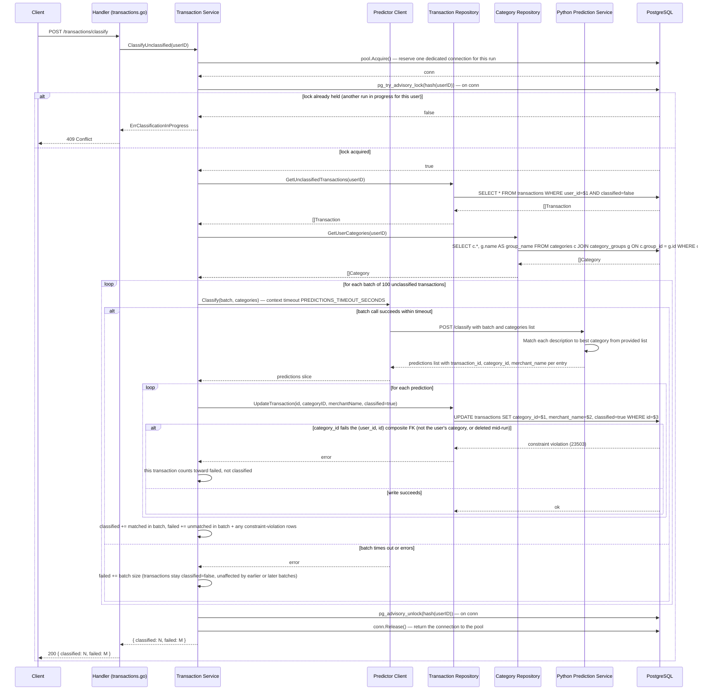
```mermaid
sequenceDiagram
    participant C as Client
    participant H as Handler (transactions.go)
    participant TS as Transaction Service
    participant PC as Predictor Client
    participant TR as Transaction Repository
    participant CR as Category Repository
    participant PS as Python Prediction Service
    participant DB as PostgreSQL

    C->>H: POST /transactions/classify
    H->>TS: ClassifyUnclassified(userID)
    TS->>DB: pool.Acquire() — reserve one dedicated connection for this run
    DB-->>TS: conn
    TS->>DB: pg_try_advisory_lock(hash(userID)) — on conn
    alt lock already held (another run in progress for this user)
        DB-->>TS: false
        TS-->>H: ErrClassificationInProgress
        H-->>C: 409 Conflict
    else lock acquired
        DB-->>TS: true
        TS->>TR: GetUnclassifiedTransactions(userID)
        TR->>DB: SELECT * FROM transactions WHERE user_id=$1 AND classified=false
        DB-->>TR: []Transaction
        TR-->>TS: []Transaction

        TS->>CR: GetUserCategories(userID)
        CR->>DB: SELECT c.*, g.name AS group_name FROM categories c JOIN category_groups g ON c.group_id = g.id WHERE c.user_id=$1
        DB-->>CR: []Category
        CR-->>TS: []Category

        loop for each batch of 100 unclassified transactions
            TS->>PC: Classify(batch, categories) — context timeout PREDICTIONS_TIMEOUT_SECONDS
            alt batch call succeeds within timeout
                PC->>PS: POST /classify with batch and categories list
                PS->>PS: Match each description to best category from provided list
                PS-->>PC: predictions list with transaction_id, category_id, merchant_name per entry
                PC-->>TS: predictions slice
                loop for each prediction
                    TS->>TR: UpdateTransaction(id, categoryID, merchantName, classified=true)
                    TR->>DB: UPDATE transactions SET category_id=$1, merchant_name=$2, classified=true WHERE id=$3
                    alt category_id fails the (user_id, id) composite FK (not the user's category, or deleted mid-run)
                        DB-->>TR: constraint violation (23503)
                        TR-->>TS: error
                        TS->>TS: this transaction counts toward failed, not classified
                    else write succeeds
                        DB-->>TR: ok
                    end
                end
                TS->>TS: classified += matched in batch, failed += unmatched in batch + any constraint-violation rows
            else batch times out or errors
                PC-->>TS: error
                TS->>TS: failed += batch size (transactions stay classified=false, unaffected by earlier or later batches)
            end
        end

        TS->>DB: pg_advisory_unlock(hash(userID)) — on conn
        TS->>DB: conn.Release() — return the connection to the pool
        TS-->>H: { classified: N, failed: M }
        H-->>C: 200 { classified: N, failed: M }
    end
```

**Why the connection is pinned for the whole run:** `pg_advisory_lock`/`pg_advisory_unlock` are scoped to the physical connection that issued them, not to "the database" as a whole or to the user's session in the application sense — two calls against different connections from a pool are two unrelated sessions as far as Postgres is concerned. Checking out a single connection via `pool.Acquire()` at the start of the run and holding it — unreleased back to the pool — through both repository fetches, every batch's writes, and the final unlock is what actually guarantees the lock and unlock observe the same session. It's also why a crash can't leak the lock: closing or returning a connection is what makes Postgres drop any advisory locks it was holding, so `conn.Release()` (or the connection simply dying with the process) has the same effect as an explicit unlock. This pinned connection is released back to the pool in the same `defer` that releases the lock — always, including on error, timeout, or panic.

The advisory lock is session-scoped, not a row in a table — it's automatically released if the connection or process holding it dies, so unlike `import_jobs` (§5, and `open-issues.md` §2.2), a crash mid-run can never leave a user permanently locked out of classifying. Splitting into 100-transaction batches, each under its own timeout, means a slow or briefly-down prediction service degrades to "some batches fail, retry later" instead of one all-or-nothing call blocking on the user's entire backlog — and because each batch's updates commit independently, work already done before a failing batch is never rolled back or lost. The per-prediction `category_id` write also isn't trusted on faith — it's enforced by the same `categories(user_id, id)` composite foreign key every other write on this table relies on (see `data-model.md`), so a response naming a category outside the batch's own list (or one deleted between the batch being built and the write happening) fails that single row's update and is simply counted toward `failed`, without affecting the rest of the batch.

**On "atomic" batches:** each row's `UPDATE` above is its own single, auto-committed SQL statement — there is no application-level transaction wrapping a whole batch. This is deliberate, not an oversight: wrapping a batch in one transaction would mean one row's constraint violation (an out-of-batch `category_id`, see above) aborts every other row in that batch, which is the opposite of the intended "one bad row doesn't block its batch" behavior. The consequence worth being explicit about: if the process crashes mid-batch, every row already written is durably `classified = true` — nothing is left half-written — but the `classified`/`failed` counters in the eventual HTTP response are a summary of what *this request* observed, not a source of truth. A crash severe enough to lose that in-memory summary also means the HTTP response itself is never delivered (the request simply fails), so there is no scenario where a client receives an inaccurate count — only "got a response" (accurate) or "got no response, safe to retry" (since a retry only ever re-queries `classified = false` rows, which is unaffected by how far the previous, failed run got).

---

## 7. Manual Transaction Creation

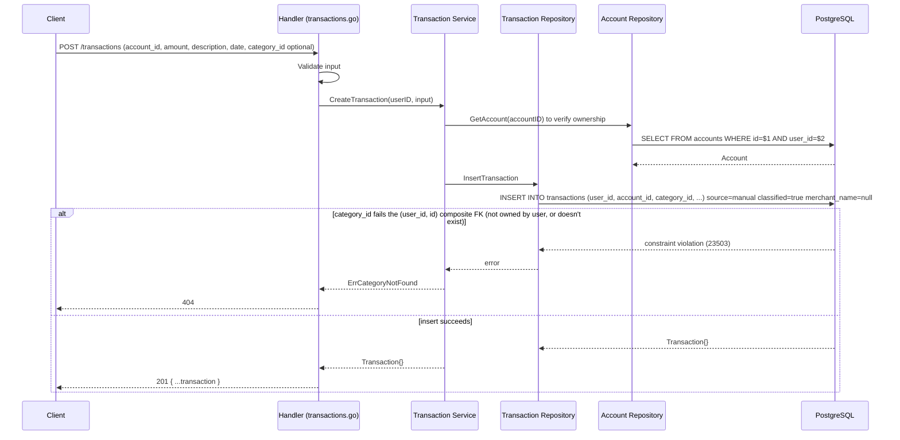
```mermaid
sequenceDiagram
    participant C as Client
    participant H as Handler (transactions.go)
    participant TS as Transaction Service
    participant TR as Transaction Repository
    participant AR as Account Repository
    participant DB as PostgreSQL

    C->>H: POST /transactions (account_id, amount, description, date, category_id optional)
    H->>H: Validate input
    H->>TS: CreateTransaction(userID, input)
    TS->>AR: GetAccount(accountID) to verify ownership
    AR->>DB: SELECT FROM accounts WHERE id=$1 AND user_id=$2
    DB-->>AR: Account

    TS->>TR: InsertTransaction
    TR->>DB: INSERT INTO transactions (user_id, account_id, category_id, ...) source=manual classified=true merchant_name=null
    alt category_id fails the (user_id, id) composite FK (not owned by user, or doesn't exist)
        DB-->>TR: constraint violation (23503)
        TR-->>TS: error
        TS-->>H: ErrCategoryNotFound
        H-->>C: 404
    else insert succeeds
        DB-->>TR: Transaction{}
        TS-->>H: Transaction{}
        H-->>C: 201 { ...transaction }
    end
```

Creating a transaction is a single-table write. There is no `accounts.balance` column to update and no snapshot to maintain — current balance is always computed at read time (see [§8, Current Balance, Balance History, and Checkpoints](#8-current-balance-balance-history-and-checkpoints)).

Account ownership is checked with an explicit `SELECT` before the insert, since the account row is needed anyway (for the closed-period check on update/delete below); category ownership isn't pre-checked the same way — `category_id` relies entirely on the `categories(user_id, id)` composite foreign key (see `data-model.md`), so an unowned or nonexistent category surfaces as a constraint violation on the `INSERT` itself, mapped to `404`.

Updating a transaction's `category_id`/`description` follows the same shape, including the same FK-backed `404` on an unowned or nonexistent `category_id`. `account_id` itself is never accepted on update — a transaction's account is fixed at creation. Updating its `amount` or `date`, or deleting it, additionally requires checking that the transaction's current `date` is after the account's latest checkpoint (`SELECT date FROM balance_checkpoints WHERE account_id = ? ORDER BY date DESC, created_at DESC LIMIT 1`) — if not, the service returns a `409` rather than silently writing a change that has no visible effect on balance.

---

## 7a. Account Creation

`POST /accounts` writes to two tables — `accounts` and its first `balance_checkpoints` row (see the invariant in §8 below: "every account has at least one checkpoint"). Both inserts run inside a single DB transaction: if either fails, the whole request fails and neither row is left behind, so an account can never exist without a checkpoint (or a checkpoint without its account).

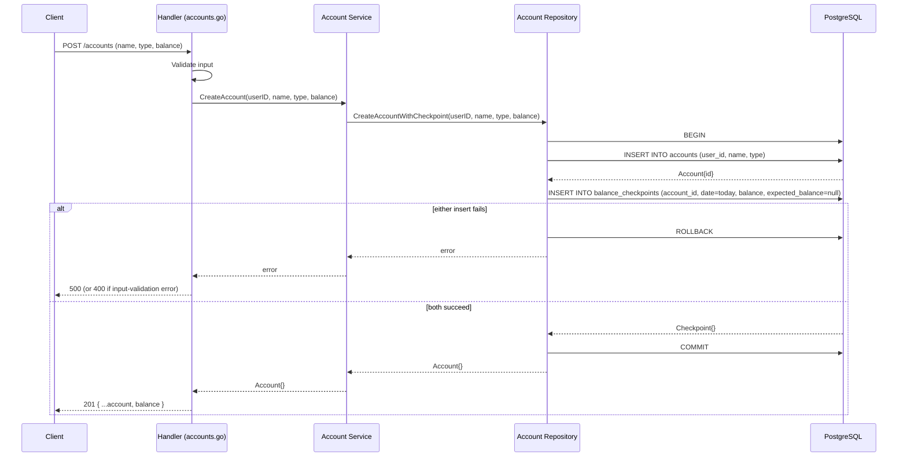
```mermaid
sequenceDiagram
    participant C as Client
    participant H as Handler (accounts.go)
    participant AS as Account Service
    participant AR as Account Repository
    participant DB as PostgreSQL

    C->>H: POST /accounts (name, type, balance)
    H->>H: Validate input
    H->>AS: CreateAccount(userID, name, type, balance)
    AS->>AR: CreateAccountWithCheckpoint(userID, name, type, balance)
    AR->>DB: BEGIN
    AR->>DB: INSERT INTO accounts (user_id, name, type)
    DB-->>AR: Account{id}
    AR->>DB: INSERT INTO balance_checkpoints (account_id, date=today, balance, expected_balance=null)
    alt either insert fails
        AR->>DB: ROLLBACK
        AR-->>AS: error
        AS-->>H: error
        H-->>C: 500 (or 400 if input-validation error)
    else both succeed
        DB-->>AR: Checkpoint{}
        AR->>DB: COMMIT
        AR-->>AS: Account{}
        AS-->>H: Account{}
        H-->>C: 201 { ...account, balance }
    end
```

This is the one remaining place in the design that genuinely needs a cross-table atomic write — every other multi-step write in this document either touches one table (§7) or is a sequence of independently-committable steps by design (e.g. the batched writes in §5 and §6, where partial progress is meant to survive a later step failing).

---

## 8. Current Balance, Balance History, and Checkpoints

`accounts` has no stored `balance` column. Every balance figure the API returns is computed from `balance_checkpoints` plus `transactions` — there is no incremental bookkeeping to keep in sync on every write.

### Invariants

- Every account has at least one checkpoint — `POST /accounts` creates the account row and its first checkpoint (dated today) together.
- Checkpoints are **append-only**: never edited or deleted. Correcting a mistake means adding a new one.
- A new checkpoint's `date` must be on or after the account's current latest checkpoint's `date`. "Latest" is ordered by `(date, created_at)` — same-day corrections are allowed and the most recently created one wins.
- A transaction with `date <=` the account's latest checkpoint date is in a **closed period**: it's excluded from every balance computation below by construction, and its `amount`/`date` cannot be edited (see `api.md`).

### Current balance

```
latest = SELECT date, balance FROM balance_checkpoints
         WHERE account_id = ? ORDER BY date DESC, created_at DESC LIMIT 1

current_balance = latest.balance
                 + SUM(amount) of transactions WHERE account_id = ? AND date > latest.date
```

No write path needs to touch this — it's recomputed on every read (`GET /accounts`, `GET /accounts/:id`).

### Balance history (`GET /accounts/history`)

For a requested date `D`, the applicable checkpoint is the latest one at or before `D` — not necessarily the account's overall latest checkpoint. A query spanning several checkpoints re-anchors at each one it crosses:

```
anchor(D) = SELECT date, balance FROM balance_checkpoints
            WHERE account_id = ? AND date <= D
            ORDER BY date DESC, created_at DESC LIMIT 1

balance(D) = anchor(D).balance
           + SUM(amount) of transactions WHERE account_id = ? AND date > anchor(D).date AND date <= D
```

If `D` is before an account's first checkpoint, there is no `anchor(D)` and no balance is reported for that date.

### Balance checkpoint creation

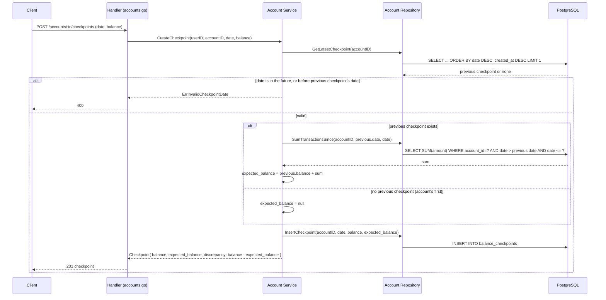
```mermaid
sequenceDiagram
    participant C as Client
    participant H as Handler (accounts.go)
    participant AS as Account Service
    participant AR as Account Repository
    participant DB as PostgreSQL

    C->>H: POST /accounts/:id/checkpoints (date, balance)
    H->>AS: CreateCheckpoint(userID, accountID, date, balance)
    AS->>AR: GetLatestCheckpoint(accountID)
    AR->>DB: SELECT ... ORDER BY date DESC, created_at DESC LIMIT 1
    DB-->>AR: previous checkpoint or none

    alt date is in the future, or before previous checkpoint's date
        AS-->>H: ErrInvalidCheckpointDate
        H-->>C: 400
    else valid
        alt previous checkpoint exists
            AS->>AR: SumTransactionsSince(accountID, previous.date, date)
            AR->>DB: SELECT SUM(amount) WHERE account_id=? AND date > previous.date AND date <= ?
            DB-->>AS: sum
            AS->>AS: expected_balance = previous.balance + sum
        else no previous checkpoint (account's first)
            AS->>AS: expected_balance = null
        end
        AS->>AR: InsertCheckpoint(accountID, date, balance, expected_balance)
        AR->>DB: INSERT INTO balance_checkpoints
        AS-->>H: Checkpoint{ balance, expected_balance, discrepancy: balance - expected_balance }
        H-->>C: 201 checkpoint
    end
```

`expected_balance` is a point-in-time record of what the system calculated *at the moment this checkpoint was created* — it is never recomputed later. Because checkpoints must be entered in non-decreasing date order, no later checkpoint or transaction edit can retroactively change what an earlier checkpoint's `expected_balance` "should have been."
