# Key Flows

Sequence diagrams for the most important request paths through the backend.

`POST /auth/register`, `POST /auth/login`, and `POST /auth/refresh` (§1, §2, §2a below) sit behind rate-limiting middleware — per-IP and, for register/login, per-email — before any of the steps shown in their diagrams run. It's omitted from the diagrams themselves to keep them focused on the auth logic; see `architecture.md` Rate Limiting for the limits and keying.

---

## 1. Email/Password Registration

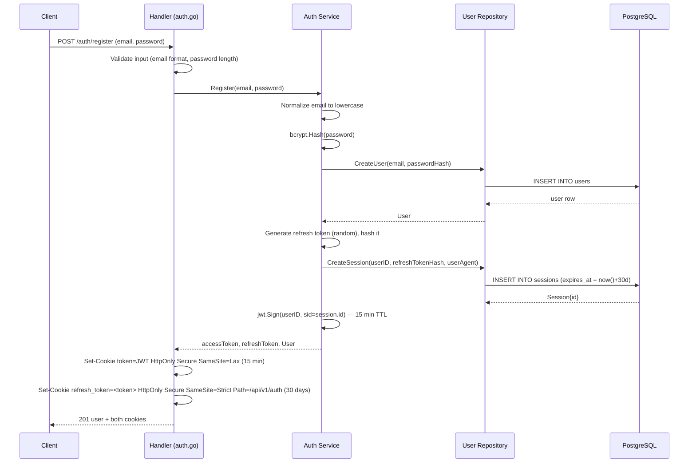
```mermaid
sequenceDiagram
    participant C as Client
    participant H as Handler (auth.go)
    participant S as Auth Service
    participant R as User Repository
    participant DB as PostgreSQL

    C->>H: POST /auth/register (email, password)
    H->>H: Validate input (email format, password length)
    H->>S: Register(email, password)
    S->>S: Normalize email to lowercase
    S->>S: bcrypt.Hash(password)
    S->>R: CreateUser(email, passwordHash)
    R->>DB: INSERT INTO users
    DB-->>R: user row
    R-->>S: User
    S->>S: Generate refresh token (random), hash it
    S->>R: CreateSession(userID, refreshTokenHash, userAgent)
    R->>DB: INSERT INTO sessions (expires_at = now()+30d)
    DB-->>R: Session{id}
    S->>S: jwt.Sign(userID, sid=session.id) — 15 min TTL
    S-->>H: accessToken, refreshToken, User
    H->>H: Set-Cookie token=JWT HttpOnly Secure SameSite=Lax (15 min)
    H->>H: Set-Cookie refresh_token=<token> HttpOnly Secure SameSite=Strict Path=/api/v1/auth (30 days)
    H-->>C: 201 user + both cookies
```

---

## 2. Email/Password Login

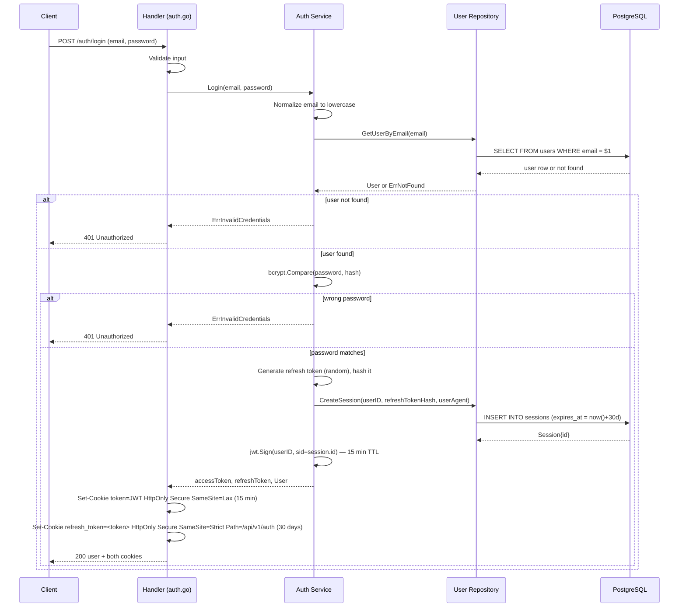
```mermaid
sequenceDiagram
    participant C as Client
    participant H as Handler (auth.go)
    participant S as Auth Service
    participant R as User Repository
    participant DB as PostgreSQL

    C->>H: POST /auth/login (email, password)
    H->>H: Validate input
    H->>S: Login(email, password)
    S->>S: Normalize email to lowercase
    S->>R: GetUserByEmail(email)
    R->>DB: SELECT FROM users WHERE email = $1
    DB-->>R: user row or not found
    R-->>S: User or ErrNotFound
    alt user not found
        S-->>H: ErrInvalidCredentials
        H-->>C: 401 Unauthorized
    else user found
        S->>S: bcrypt.Compare(password, hash)
        alt wrong password
            S-->>H: ErrInvalidCredentials
            H-->>C: 401 Unauthorized
        else password matches
            S->>S: Generate refresh token (random), hash it
            S->>R: CreateSession(userID, refreshTokenHash, userAgent)
            R->>DB: INSERT INTO sessions (expires_at = now()+30d)
            DB-->>R: Session{id}
            S->>S: jwt.Sign(userID, sid=session.id) — 15 min TTL
            S-->>H: accessToken, refreshToken, User
            H->>H: Set-Cookie token=JWT HttpOnly Secure SameSite=Lax (15 min)
            H->>H: Set-Cookie refresh_token=<token> HttpOnly Secure SameSite=Strict Path=/api/v1/auth (30 days)
            H-->>C: 200 user + both cookies
        end
    end
```

---

## 2a. Token Refresh

The access token (`token` cookie) expires every 15 minutes by design — the frontend calls this endpoint (proactively, or reactively after a `401`) to get a new one without forcing the user to log in again, as long as the refresh token is still valid.

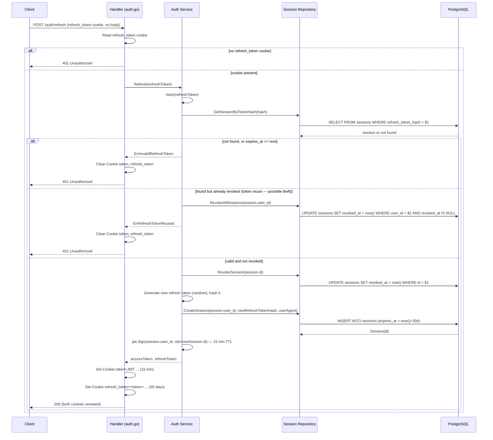
```mermaid
sequenceDiagram
    participant C as Client
    participant H as Handler (auth.go)
    participant S as Auth Service
    participant R as Session Repository
    participant DB as PostgreSQL

    C->>H: POST /auth/refresh (refresh_token cookie, no body)
    H->>H: Read refresh_token cookie
    alt no refresh_token cookie
        H-->>C: 401 Unauthorized
    else cookie present
        H->>S: Refresh(refreshToken)
        S->>S: hash(refreshToken)
        S->>R: GetSessionByTokenHash(hash)
        R->>DB: SELECT FROM sessions WHERE refresh_token_hash = $1
        DB-->>R: session or not found

        alt not found, or expires_at <= now
            S-->>H: ErrInvalidRefreshToken
            H->>H: Clear-Cookie token, refresh_token
            H-->>C: 401 Unauthorized
        else found but already revoked (token reuse — possible theft)
            S->>R: RevokeAllSessions(session.user_id)
            R->>DB: UPDATE sessions SET revoked_at = now() WHERE user_id = $1 AND revoked_at IS NULL
            S-->>H: ErrRefreshTokenReused
            H->>H: Clear-Cookie token, refresh_token
            H-->>C: 401 Unauthorized
        else valid and not revoked
            S->>R: RevokeSession(session.id)
            R->>DB: UPDATE sessions SET revoked_at = now() WHERE id = $1
            S->>S: Generate new refresh token (random), hash it
            S->>R: CreateSession(session.user_id, newRefreshTokenHash, userAgent)
            R->>DB: INSERT INTO sessions (expires_at = now()+30d)
            DB-->>R: Session{id}
            S->>S: jwt.Sign(session.user_id, sid=newSession.id) — 15 min TTL
            S-->>H: accessToken, refreshToken
            H->>H: Set-Cookie token=JWT ... (15 min)
            H->>H: Set-Cookie refresh_token=<token> ... (30 days)
            H-->>C: 200 (both cookies renewed)
        end
    end
```

Rotation means every refresh token is single-use: each call to this endpoint revokes the session it was presented with and creates a fresh one. If a refresh token is ever presented *after* it's already been rotated away, that's a strong signal it was stolen and used by someone else before (or after) its legitimate owner — the response is to revoke every session for that user, forcing a full re-login everywhere.

---

## 2b. Logout

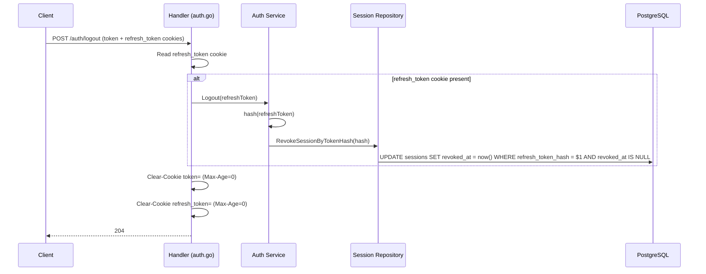
```mermaid
sequenceDiagram
    participant C as Client
    participant H as Handler (auth.go)
    participant S as Auth Service
    participant R as Session Repository
    participant DB as PostgreSQL

    C->>H: POST /auth/logout (token + refresh_token cookies)
    H->>H: Read refresh_token cookie
    alt refresh_token cookie present
        H->>S: Logout(refreshToken)
        S->>S: hash(refreshToken)
        S->>R: RevokeSessionByTokenHash(hash)
        R->>DB: UPDATE sessions SET revoked_at = now() WHERE refresh_token_hash = $1 AND revoked_at IS NULL
    end
    H->>H: Clear-Cookie token= (Max-Age=0)
    H->>H: Clear-Cookie refresh_token= (Max-Age=0)
    H-->>C: 204
```

`POST /auth/logout/all` (auth required, access token only) follows the same shape but revokes every non-revoked session belonging to `ctx.UserID` instead of looking one up by refresh token — this is the "log out everywhere" action, e.g. after a stolen-device scare. It also clears the caller's own cookies, since that session is included in the revocation.

---

## 3. OAuth Login (Google or GitHub)

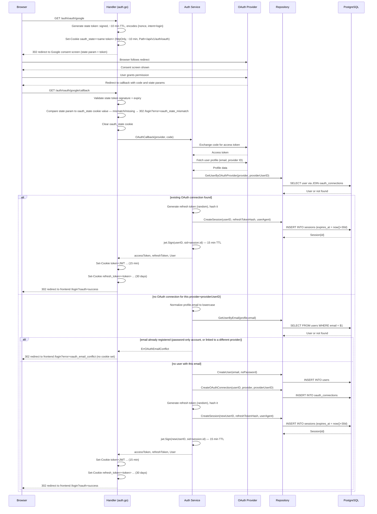
```mermaid
sequenceDiagram
    participant C as Browser
    participant H as Handler (auth.go)
    participant S as Auth Service
    participant O as OAuth Provider
    participant R as Repository
    participant DB as PostgreSQL

    C->>H: GET /auth/oauth/google
    H->>H: Generate state token: signed, ~10 min TTL, encodes {nonce, intent=login}
    H->>H: Set-Cookie oauth_state=<same token> (httpOnly, ~10 min, Path=/api/v1/auth/oauth)
    H-->>C: 302 redirect to Google consent screen (state param = token)

    C->>O: Browser follows redirect
    O-->>C: Consent screen shown
    C->>O: User grants permission
    O-->>C: Redirect to callback with code and state params

    C->>H: GET /auth/oauth/google/callback
    H->>H: Validate state token signature + expiry
    H->>H: Compare state param to oauth_state cookie value — mismatch/missing → 302 /login?error=oauth_state_mismatch
    H->>H: Clear oauth_state cookie
    H->>S: OAuthCallback(provider, code)
    S->>O: Exchange code for access token
    O-->>S: Access token
    S->>O: Fetch user profile (email, provider ID)
    O-->>S: Profile data

    S->>R: GetUserByOAuthProvider(provider, providerUserID)
    R->>DB: SELECT user via JOIN oauth_connections
    DB-->>R: User or not found

    alt existing OAuth connection found
        S->>S: Generate refresh token (random), hash it
        S->>R: CreateSession(userID, refreshTokenHash, userAgent)
        R->>DB: INSERT INTO sessions (expires_at = now()+30d)
        DB-->>R: Session{id}
        S->>S: jwt.Sign(userID, sid=session.id) — 15 min TTL
        S-->>H: accessToken, refreshToken, User
        H->>H: Set-Cookie token=JWT ... (15 min)
        H->>H: Set-Cookie refresh_token=<token> ... (30 days)
        H-->>C: 302 redirect to frontend /login?oauth=success
    else no OAuth connection for this provider+providerUserID
        S->>S: Normalize profile.email to lowercase
        S->>R: GetUserByEmail(profile.email)
        R->>DB: SELECT FROM users WHERE email = $1
        DB-->>R: User or not found
        alt email already registered (password-only account, or linked to a different provider)
            S-->>H: ErrOAuthEmailConflict
            H-->>C: 302 redirect to frontend /login?error=oauth_email_conflict (no cookie set)
        else no user with this email
            S->>R: CreateUser(email, noPassword)
            R->>DB: INSERT INTO users
            S->>R: CreateOAuthConnection(userID, provider, providerUserID)
            R->>DB: INSERT INTO oauth_connections
            S->>S: Generate refresh token (random), hash it
            S->>R: CreateSession(newUserID, refreshTokenHash, userAgent)
            R->>DB: INSERT INTO sessions (expires_at = now()+30d)
            DB-->>R: Session{id}
            S->>S: jwt.Sign(newUserID, sid=session.id) — 15 min TTL
            S-->>H: accessToken, refreshToken, User
            H->>H: Set-Cookie token=JWT ... (15 min)
            H->>H: Set-Cookie refresh_token=<token> ... (30 days)
            H-->>C: 302 redirect to frontend /login?oauth=success
        end
    end
```

`ErrOAuthEmailConflict` never creates or links anything — the user must log in with their existing method (password, or the OAuth provider already linked) and, if they want Google/GitHub login too, link it explicitly from settings (see §3a below). This is the deliberate alternative to auto-merging accounts by email, which would let anyone with a victim's email take over their account by registering a password first (see `open-issues.md` §1.1).

**`state` storage:** `state` is a signed, self-contained token (HMAC, ~10 min expiry) rather than a value kept in an in-memory map or shared server-side store — it works the same way regardless of how many backend processes are running. Validating the signature and expiry proves the token is genuine and unexpired, but not that the callback is happening in the same browser that started the flow: the `state` value travels through the provider's redirect and is visible in browser history and `Referer` headers, so an attacker who obtains it could replay it from their own browser. The `oauth_state` cookie is what closes that gap — it's set right before redirecting out and compared byte-for-byte against the `state` query param on callback, so a mismatch (or a missing cookie, e.g. the callback arriving in a different browser) is rejected as `oauth_state_mismatch`. This same mechanism covers §3a below.

---

## 3a. Linking an OAuth Provider to an Existing Account (Settings)

Reached from a settings page, by an already-authenticated user who wants to add Google/GitHub sign-in to an account they created with a password (or add a second provider). This is the only supported way to associate an OAuth identity with an account that already exists — never automatic, never triggered by a login attempt.

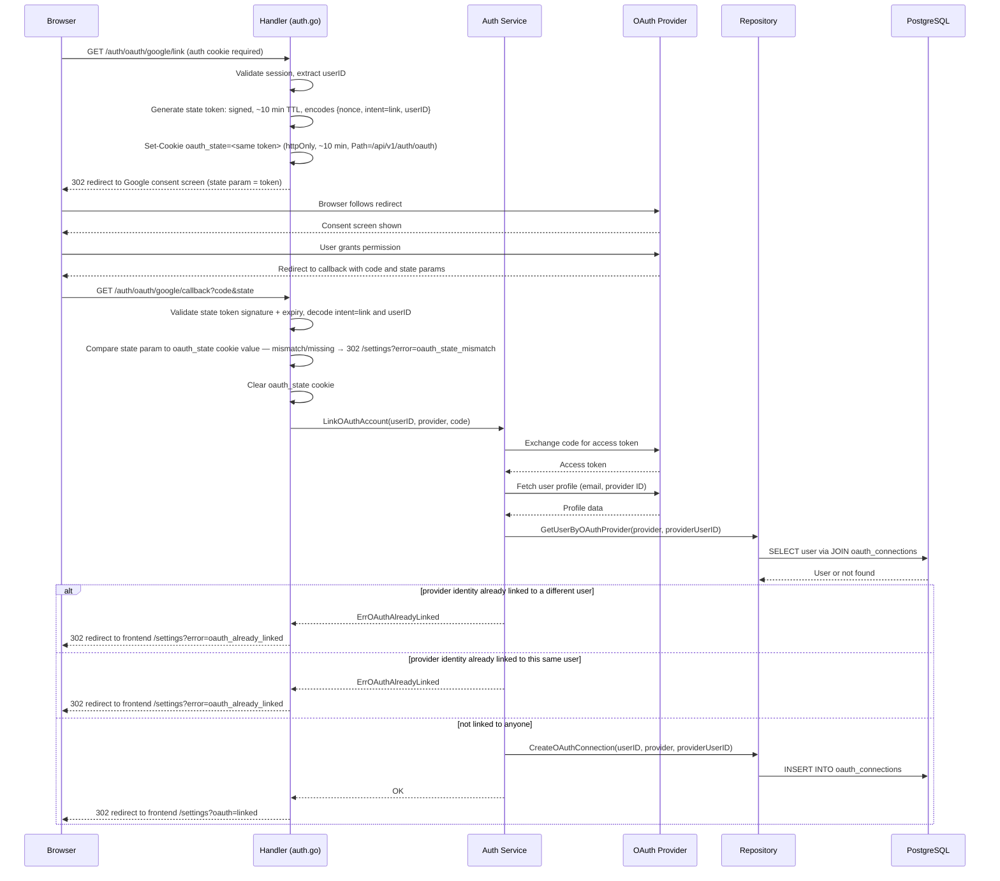
```mermaid
sequenceDiagram
    participant C as Browser
    participant H as Handler (auth.go)
    participant S as Auth Service
    participant O as OAuth Provider
    participant R as Repository
    participant DB as PostgreSQL

    C->>H: GET /auth/oauth/google/link (auth cookie required)
    H->>H: Validate session, extract userID
    H->>H: Generate state token: signed, ~10 min TTL, encodes {nonce, intent=link, userID}
    H->>H: Set-Cookie oauth_state=<same token> (httpOnly, ~10 min, Path=/api/v1/auth/oauth)
    H-->>C: 302 redirect to Google consent screen (state param = token)

    C->>O: Browser follows redirect
    O-->>C: Consent screen shown
    C->>O: User grants permission
    O-->>C: Redirect to callback with code and state params

    C->>H: GET /auth/oauth/google/callback?code&state
    H->>H: Validate state token signature + expiry, decode intent=link and userID
    H->>H: Compare state param to oauth_state cookie value — mismatch/missing → 302 /settings?error=oauth_state_mismatch
    H->>H: Clear oauth_state cookie
    H->>S: LinkOAuthAccount(userID, provider, code)
    S->>O: Exchange code for access token
    O-->>S: Access token
    S->>O: Fetch user profile (email, provider ID)
    O-->>S: Profile data

    S->>R: GetUserByOAuthProvider(provider, providerUserID)
    R->>DB: SELECT user via JOIN oauth_connections
    DB-->>R: User or not found

    alt provider identity already linked to a different user
        S-->>H: ErrOAuthAlreadyLinked
        H-->>C: 302 redirect to frontend /settings?error=oauth_already_linked
    else provider identity already linked to this same user
        S-->>H: ErrOAuthAlreadyLinked
        H-->>C: 302 redirect to frontend /settings?error=oauth_already_linked
    else not linked to anyone
        S->>R: CreateOAuthConnection(userID, provider, providerUserID)
        R->>DB: INSERT INTO oauth_connections
        S-->>H: OK
        H-->>C: 302 redirect to frontend /settings?oauth=linked
    end
```

The callback route (`GET /auth/oauth/:provider/callback`) is shared between §3 (login/signup) and §3a (linking) — the `state` token's `intent` field, set when the flow was initiated, determines which branch runs. `state` is otherwise handled as described in §3's CSRF notes.

The `UNIQUE (provider, provider_user_id)` constraint on `oauth_connections` (see `data-model.md`) is what actually guarantees a given Google/GitHub identity can only ever be linked to one user — the `GetUserByOAuthProvider` check above is the same lookup the login flow uses, kept consistent for both paths.

---

## 4. Authenticated Request (JWT Middleware)

Every protected endpoint runs this flow before the handler is called.

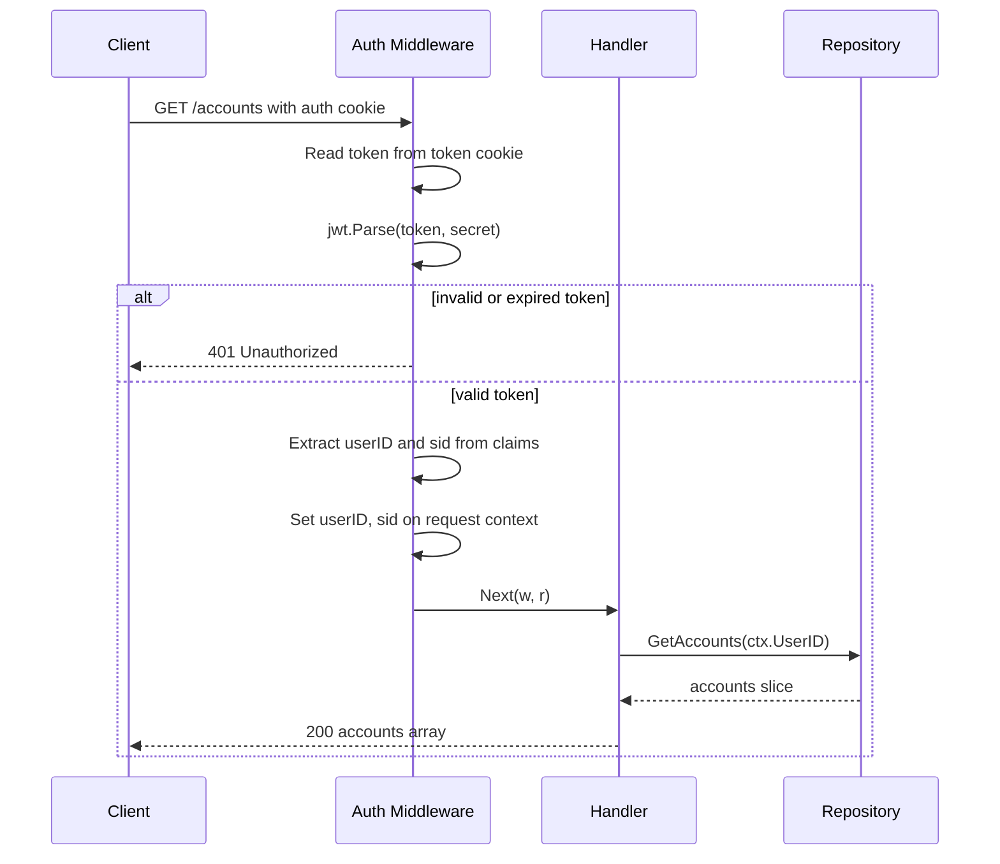
```mermaid
sequenceDiagram
    participant C as Client
    participant M as Auth Middleware
    participant H as Handler
    participant R as Repository

    C->>M: GET /accounts with auth cookie
    M->>M: Read token from token cookie
    M->>M: jwt.Parse(token, secret)
    alt invalid or expired token
        M-->>C: 401 Unauthorized
    else valid token
        M->>M: Extract userID and sid from claims
        M->>M: Set userID, sid on request context
        M->>H: Next(w, r)
        H->>R: GetAccounts(ctx.UserID)
        R-->>H: accounts slice
        H-->>C: 200 accounts array
    end
```

This middleware never queries `sessions` — it only checks the access token's signature and expiry, which is what keeps every authenticated request fast. This is also the source of the bounded revocation lag noted in `data-model.md`'s `sessions` design decision: revoking a session (logout, `DELETE /auth/sessions/:id`, or `POST /auth/logout/all`) stops future refreshes immediately, but an access token already issued from that session stays valid for up to its remaining 15-minute TTL. `sid` is carried on the context so `GET /auth/sessions` can mark which listed session is the one making the request ("this device").

---

## 5. CSV Import

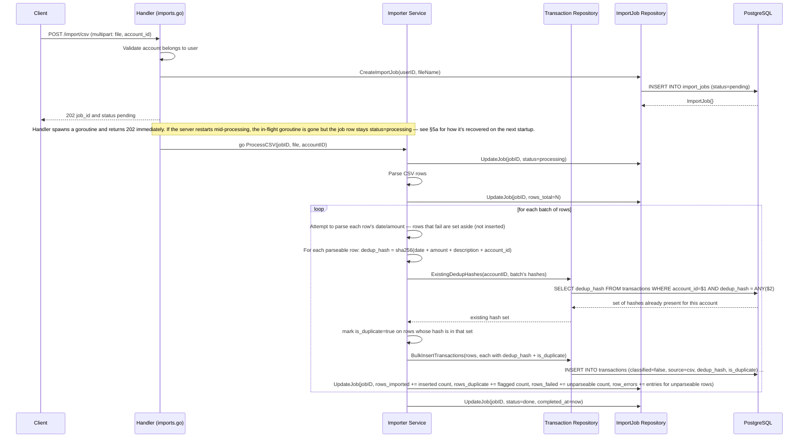
```mermaid
sequenceDiagram
    participant C as Client
    participant H as Handler (imports.go)
    participant IS as Importer Service
    participant TR as Transaction Repository
    participant IR as ImportJob Repository
    participant DB as PostgreSQL

    C->>H: POST /import/csv (multipart: file, account_id)
    H->>H: Validate account belongs to user
    H->>IR: CreateImportJob(userID, fileName)
    IR->>DB: INSERT INTO import_jobs (status=pending)
    DB-->>IR: ImportJob{}
    H-->>C: 202 job_id and status pending

    Note over H,IS: Handler spawns a goroutine and returns 202 immediately. If the server restarts mid-processing, the in-flight goroutine is gone but the job row stays status=processing — see §5a for how it's recovered on the next startup.

    H->>IS: go ProcessCSV(jobID, file, accountID)
    IS->>IR: UpdateJob(jobID, status=processing)
    IS->>IS: Parse CSV rows
    IS->>IR: UpdateJob(jobID, rows_total=N)

    loop for each batch of rows
        IS->>IS: Attempt to parse each row's date/amount — rows that fail are set aside (not inserted)
        IS->>IS: For each parseable row: dedup_hash = sha256(date + amount + description + account_id)
        IS->>TR: ExistingDedupHashes(accountID, batch's hashes)
        TR->>DB: SELECT dedup_hash FROM transactions WHERE account_id=$1 AND dedup_hash = ANY($2)
        DB-->>TR: set of hashes already present for this account
        TR-->>IS: existing hash set
        IS->>IS: mark is_duplicate=true on rows whose hash is in that set
        IS->>TR: BulkInsertTransactions(rows, each with dedup_hash + is_duplicate)
        TR->>DB: INSERT INTO transactions (classified=false, source=csv, dedup_hash, is_duplicate) ...
        IS->>IR: UpdateJob(jobID, rows_imported += inserted count, rows_duplicate += flagged count, rows_failed += unparseable count, row_errors += entries for unparseable rows)
    end

    IS->>IR: UpdateJob(jobID, status=done, completed_at=now)
```

The dedup lookup is batched (one `SELECT ... = ANY($2)` per batch against that batch's hash set), not one query per row, so duplicate detection doesn't turn an already-batched insert loop back into row-at-a-time database round trips. A row that fails to parse never reaches the hash/dedup step at all — it's counted directly into `rows_failed` and `row_errors`, and a genuinely bad row can never be misreported as a duplicate or vice versa, since the two checks are mutually exclusive stages of the same loop.

---

## 5a. Startup Recovery Sweep (Stuck Import Jobs)

Runs once, synchronously, in `cmd/api/main.go` before the HTTP server starts accepting requests — a direct consequence of the note in §5: a server restart abandons any goroutine that was mid-`ProcessCSV`, leaving its `import_jobs` row stuck at `status=processing` forever with nothing left to move it forward.

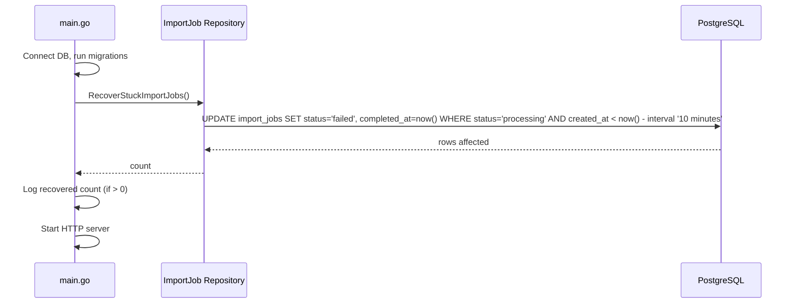
```mermaid
sequenceDiagram
    participant M as main.go
    participant IR as ImportJob Repository
    participant DB as PostgreSQL

    M->>M: Connect DB, run migrations
    M->>IR: RecoverStuckImportJobs()
    IR->>DB: UPDATE import_jobs SET status='failed', completed_at=now() WHERE status='processing' AND created_at < now() - interval '10 minutes'
    DB-->>IR: rows affected
    IR-->>M: count
    M->>M: Log recovered count (if > 0)
    M->>M: Start HTTP server
```

Staleness is judged against `created_at` rather than a separate "processing started" timestamp — a job's `status` moves to `processing` within the same goroutine that created it, essentially immediately after the row is inserted, so `created_at` is a close enough proxy without adding a column. 10 minutes is comfortably longer than any real CSV import should take, accepting a small risk of failing a legitimately very slow job in exchange for not needing a size-based threshold.

This is a one-time sweep at process boot, not a recurring background check — it only recovers jobs abandoned by a restart. A job whose processing goroutine dies without the process itself restarting (e.g. a panic recovered by a global handler elsewhere, or a silently wedged goroutine) is out of scope, consistent with `open-issues.md`'s framing of this as a small, well-scoped fix rather than a full job-queue rewrite.

A job recovered this way ends as `failed`, with whatever `rows_imported` had reached before the restart preserved as-is — visible to the client via `GET /import/jobs/:id`, same as any other `failed` job. There's no partial-completion detail beyond that count (see `open-issues.md` §2.4 for the broader partial-failure reporting gap, which applies here too).

---

## 6. Transaction Classification (Prediction Service)

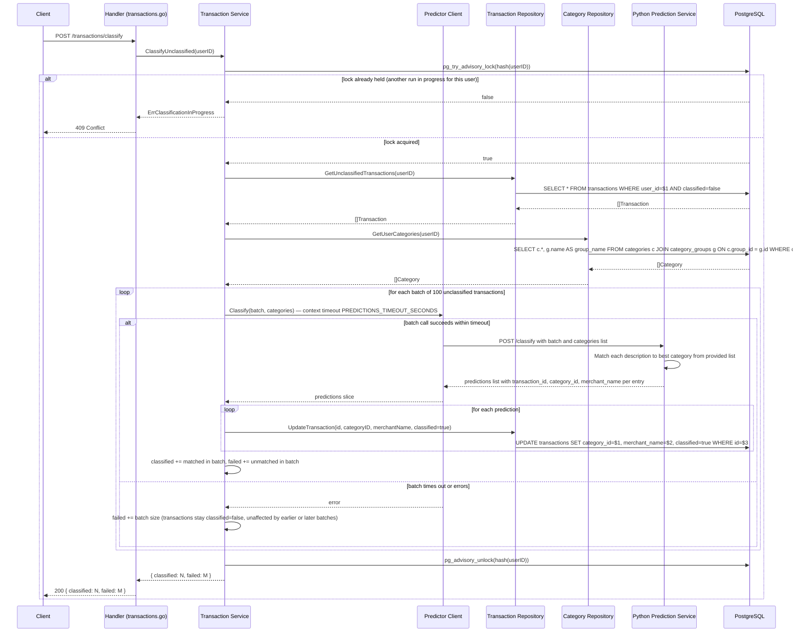
```mermaid
sequenceDiagram
    participant C as Client
    participant H as Handler (transactions.go)
    participant TS as Transaction Service
    participant PC as Predictor Client
    participant TR as Transaction Repository
    participant CR as Category Repository
    participant PS as Python Prediction Service
    participant DB as PostgreSQL

    C->>H: POST /transactions/classify
    H->>TS: ClassifyUnclassified(userID)
    TS->>DB: pg_try_advisory_lock(hash(userID))
    alt lock already held (another run in progress for this user)
        DB-->>TS: false
        TS-->>H: ErrClassificationInProgress
        H-->>C: 409 Conflict
    else lock acquired
        DB-->>TS: true
        TS->>TR: GetUnclassifiedTransactions(userID)
        TR->>DB: SELECT * FROM transactions WHERE user_id=$1 AND classified=false
        DB-->>TR: []Transaction
        TR-->>TS: []Transaction

        TS->>CR: GetUserCategories(userID)
        CR->>DB: SELECT c.*, g.name AS group_name FROM categories c JOIN category_groups g ON c.group_id = g.id WHERE c.user_id=$1
        DB-->>CR: []Category
        CR-->>TS: []Category

        loop for each batch of 100 unclassified transactions
            TS->>PC: Classify(batch, categories) — context timeout PREDICTIONS_TIMEOUT_SECONDS
            alt batch call succeeds within timeout
                PC->>PS: POST /classify with batch and categories list
                PS->>PS: Match each description to best category from provided list
                PS-->>PC: predictions list with transaction_id, category_id, merchant_name per entry
                PC-->>TS: predictions slice
                loop for each prediction
                    TS->>TR: UpdateTransaction(id, categoryID, merchantName, classified=true)
                    TR->>DB: UPDATE transactions SET category_id=$1, merchant_name=$2, classified=true WHERE id=$3
                end
                TS->>TS: classified += matched in batch, failed += unmatched in batch
            else batch times out or errors
                PC-->>TS: error
                TS->>TS: failed += batch size (transactions stay classified=false, unaffected by earlier or later batches)
            end
        end

        TS->>DB: pg_advisory_unlock(hash(userID))
        TS-->>H: { classified: N, failed: M }
        H-->>C: 200 { classified: N, failed: M }
    end
```

The advisory lock is session-scoped, not a row in a table — it's automatically released if the connection or process holding it dies, so unlike `import_jobs` (§5, and `open-issues.md` §2.2), a crash mid-run can never leave a user permanently locked out of classifying. Splitting into 100-transaction batches, each under its own timeout, means a slow or briefly-down prediction service degrades to "some batches fail, retry later" instead of one all-or-nothing call blocking on the user's entire backlog — and because each batch's updates commit independently, work already done before a failing batch is never rolled back or lost.

---

## 7. Manual Transaction Creation

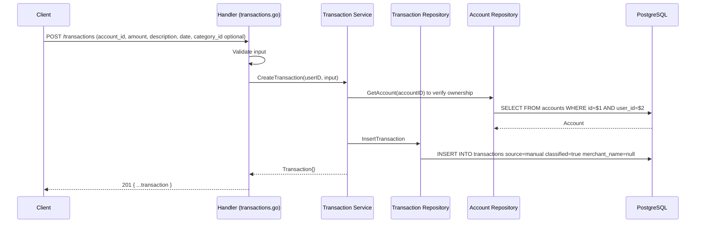
```mermaid
sequenceDiagram
    participant C as Client
    participant H as Handler (transactions.go)
    participant TS as Transaction Service
    participant TR as Transaction Repository
    participant AR as Account Repository
    participant DB as PostgreSQL

    C->>H: POST /transactions (account_id, amount, description, date, category_id optional)
    H->>H: Validate input
    H->>TS: CreateTransaction(userID, input)
    TS->>AR: GetAccount(accountID) to verify ownership
    AR->>DB: SELECT FROM accounts WHERE id=$1 AND user_id=$2
    DB-->>AR: Account

    TS->>TR: InsertTransaction
    TR->>DB: INSERT INTO transactions source=manual classified=true merchant_name=null

    TS-->>H: Transaction{}
    H-->>C: 201 { ...transaction }
```

Creating a transaction is a single-table write. There is no `accounts.balance` column to update and no snapshot to maintain — current balance is always computed at read time (see [§8, Current Balance, Balance History, and Checkpoints](#8-current-balance-balance-history-and-checkpoints)).

Updating a transaction's `category_id`/`description` follows the same shape. Updating its `amount` or `date`, or deleting it, additionally requires checking that the transaction's current `date` is after the account's latest checkpoint (`SELECT date FROM balance_checkpoints WHERE account_id = ? ORDER BY date DESC, created_at DESC LIMIT 1`) — if not, the service returns a `409` rather than silently writing a change that has no visible effect on balance.

---

## 7a. Account Creation

`POST /accounts` writes to two tables — `accounts` and its first `balance_checkpoints` row (see the invariant in §8 below: "every account has at least one checkpoint"). Both inserts run inside a single DB transaction: if either fails, the whole request fails and neither row is left behind, so an account can never exist without a checkpoint (or a checkpoint without its account).

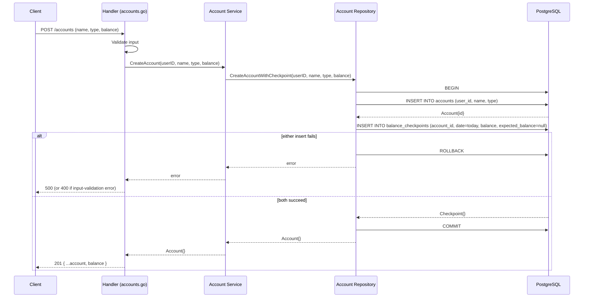
```mermaid
sequenceDiagram
    participant C as Client
    participant H as Handler (accounts.go)
    participant AS as Account Service
    participant AR as Account Repository
    participant DB as PostgreSQL

    C->>H: POST /accounts (name, type, balance)
    H->>H: Validate input
    H->>AS: CreateAccount(userID, name, type, balance)
    AS->>AR: CreateAccountWithCheckpoint(userID, name, type, balance)
    AR->>DB: BEGIN
    AR->>DB: INSERT INTO accounts (user_id, name, type)
    DB-->>AR: Account{id}
    AR->>DB: INSERT INTO balance_checkpoints (account_id, date=today, balance, expected_balance=null)
    alt either insert fails
        AR->>DB: ROLLBACK
        AR-->>AS: error
        AS-->>H: error
        H-->>C: 500 (or 400 if input-validation error)
    else both succeed
        DB-->>AR: Checkpoint{}
        AR->>DB: COMMIT
        AR-->>AS: Account{}
        AS-->>H: Account{}
        H-->>C: 201 { ...account, balance }
    end
```

This is the one remaining place in the design that genuinely needs a cross-table atomic write — every other multi-step write in this document either touches one table (§7) or is a sequence of independently-committable steps by design (e.g. the batched writes in §5 and §6, where partial progress is meant to survive a later step failing).

---

## 8. Current Balance, Balance History, and Checkpoints

`accounts` has no stored `balance` column. Every balance figure the API returns is computed from `balance_checkpoints` plus `transactions` — there is no incremental bookkeeping to keep in sync on every write.

### Invariants

- Every account has at least one checkpoint — `POST /accounts` creates the account row and its first checkpoint (dated today) together.
- Checkpoints are **append-only**: never edited or deleted. Correcting a mistake means adding a new one.
- A new checkpoint's `date` must be on or after the account's current latest checkpoint's `date`. "Latest" is ordered by `(date, created_at)` — same-day corrections are allowed and the most recently created one wins.
- A transaction with `date <=` the account's latest checkpoint date is in a **closed period**: it's excluded from every balance computation below by construction, and its `amount`/`date` cannot be edited (see `api.md`).

### Current balance

```
latest = SELECT date, balance FROM balance_checkpoints
         WHERE account_id = ? ORDER BY date DESC, created_at DESC LIMIT 1

current_balance = latest.balance
                 + SUM(amount) of transactions WHERE account_id = ? AND date > latest.date
```

No write path needs to touch this — it's recomputed on every read (`GET /accounts`, `GET /accounts/:id`).

### Balance history (`GET /accounts/history`)

For a requested date `D`, the applicable checkpoint is the latest one at or before `D` — not necessarily the account's overall latest checkpoint. A query spanning several checkpoints re-anchors at each one it crosses:

```
anchor(D) = SELECT date, balance FROM balance_checkpoints
            WHERE account_id = ? AND date <= D
            ORDER BY date DESC, created_at DESC LIMIT 1

balance(D) = anchor(D).balance
           + SUM(amount) of transactions WHERE account_id = ? AND date > anchor(D).date AND date <= D
```

If `D` is before an account's first checkpoint, there is no `anchor(D)` and no balance is reported for that date.

### Balance checkpoint creation

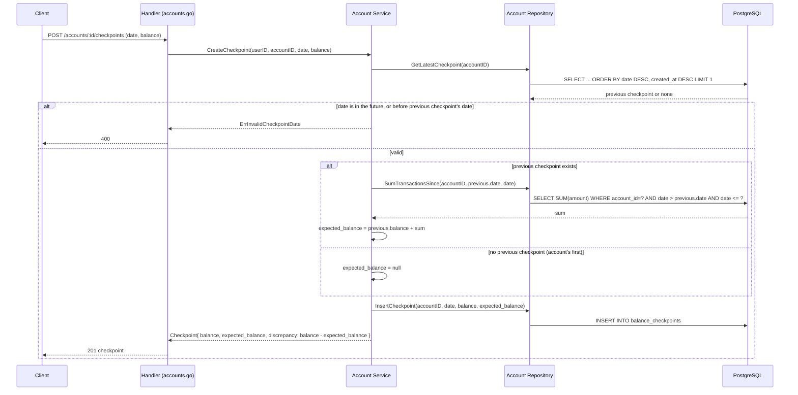
```mermaid
sequenceDiagram
    participant C as Client
    participant H as Handler (accounts.go)
    participant AS as Account Service
    participant AR as Account Repository
    participant DB as PostgreSQL

    C->>H: POST /accounts/:id/checkpoints (date, balance)
    H->>AS: CreateCheckpoint(userID, accountID, date, balance)
    AS->>AR: GetLatestCheckpoint(accountID)
    AR->>DB: SELECT ... ORDER BY date DESC, created_at DESC LIMIT 1
    DB-->>AR: previous checkpoint or none

    alt date is in the future, or before previous checkpoint's date
        AS-->>H: ErrInvalidCheckpointDate
        H-->>C: 400
    else valid
        alt previous checkpoint exists
            AS->>AR: SumTransactionsSince(accountID, previous.date, date)
            AR->>DB: SELECT SUM(amount) WHERE account_id=? AND date > previous.date AND date <= ?
            DB-->>AS: sum
            AS->>AS: expected_balance = previous.balance + sum
        else no previous checkpoint (account's first)
            AS->>AS: expected_balance = null
        end
        AS->>AR: InsertCheckpoint(accountID, date, balance, expected_balance)
        AR->>DB: INSERT INTO balance_checkpoints
        AS-->>H: Checkpoint{ balance, expected_balance, discrepancy: balance - expected_balance }
        H-->>C: 201 checkpoint
    end
```

`expected_balance` is a point-in-time record of what the system calculated *at the moment this checkpoint was created* — it is never recomputed later. Because checkpoints must be entered in non-decreasing date order, no later checkpoint or transaction edit can retroactively change what an earlier checkpoint's `expected_balance` "should have been."
