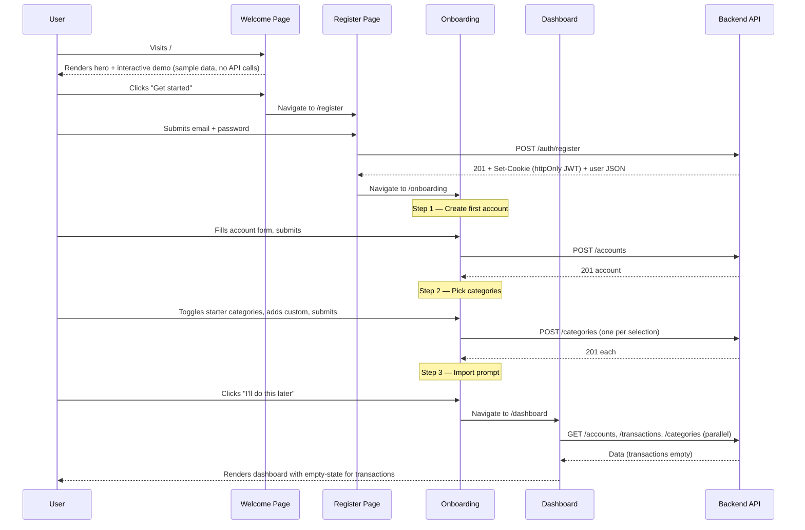
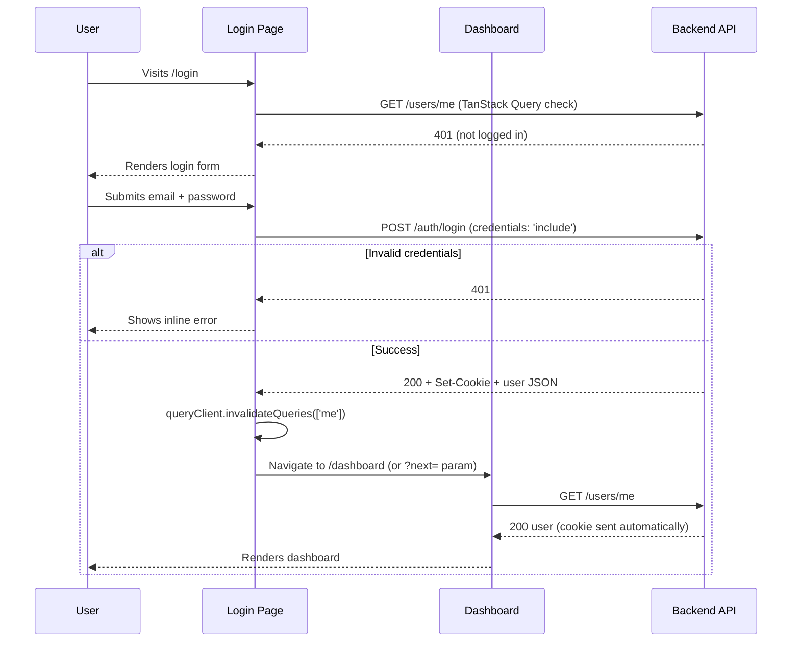
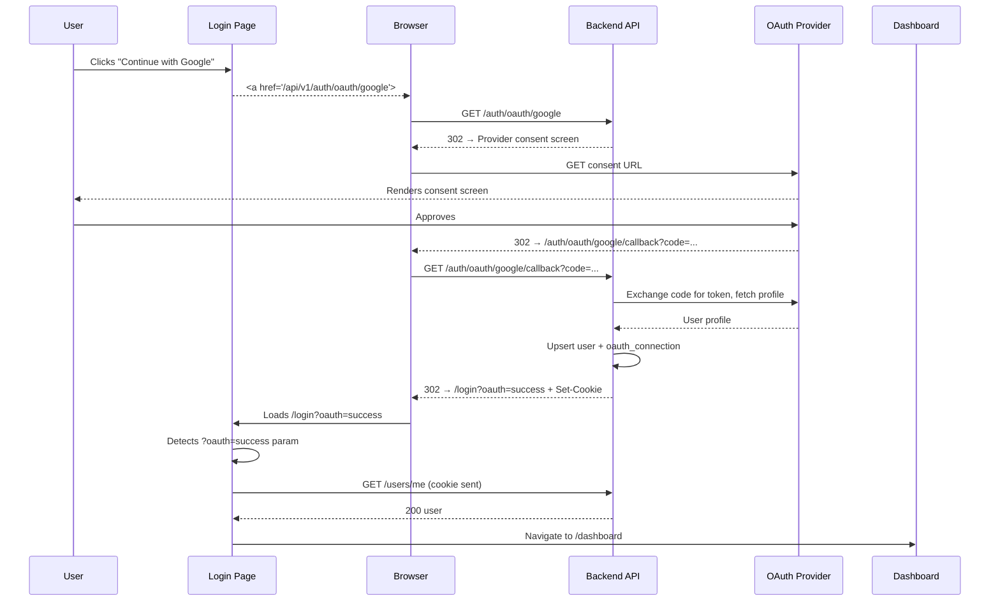
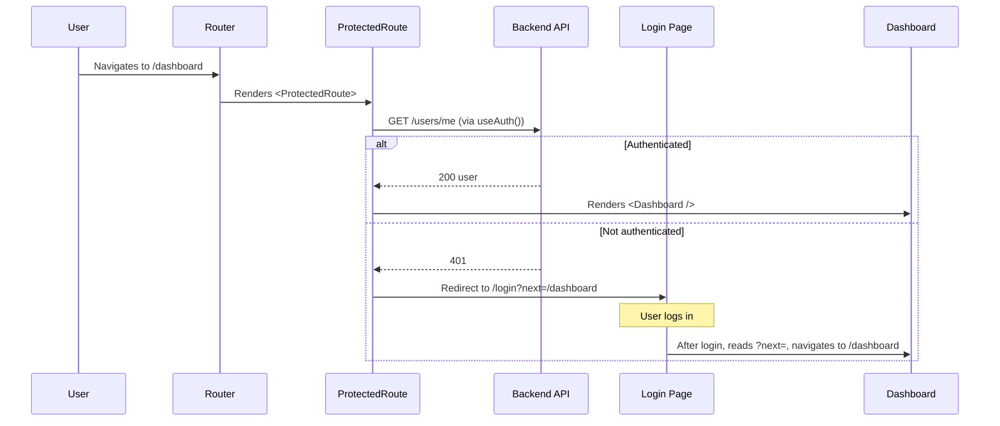
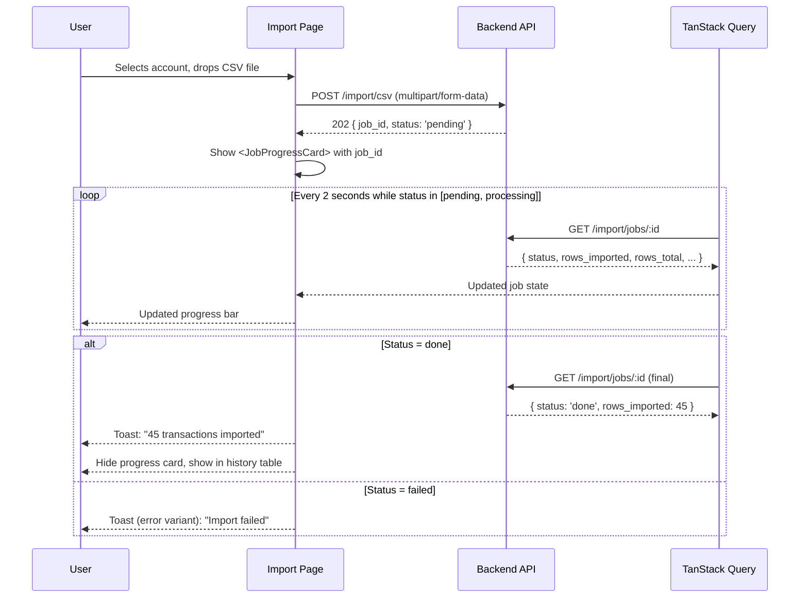
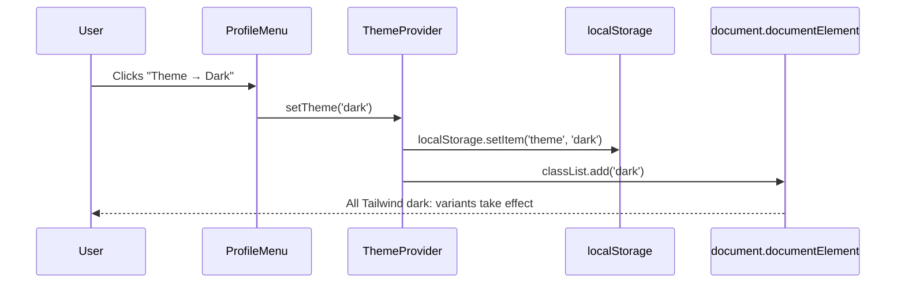
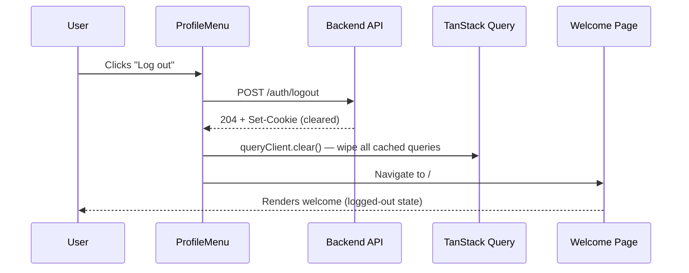
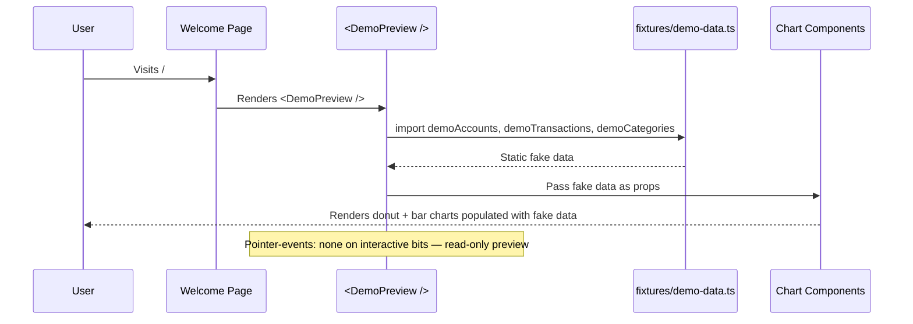

# Frontend Flows

Sequence diagrams for the key user journeys, from the frontend's perspective. Backend internals are abstracted to "Backend API".

---

## 1. New User: Welcome → Register → Onboarding → Dashboard

---

## 2. Returning User: Login (Email/Password)

---

## 3. OAuth Login (Google / GitHub)

OAuth flows happen mostly outside the React app — the browser performs full-page redirects. The backend sets the cookie before bouncing the user back.

---

## 4. Protected Route Guard

---

## 5. CSV Import with Job Polling

---

## 6. Theme Toggle

On page load, `<ThemeProvider>` reads `localStorage` (or system preference) and applies the class before paint to avoid a flash of unstyled content.

---

## 7. Logout

---

## 8. Welcome Page Demo Preview (No API)

The interactive preview on `/` demonstrates the dashboard without requiring a backend.

The same chart, table, and account-card components from `/dashboard` are reused — they take their data as props rather than fetching, so they work for both real and demo contexts.
